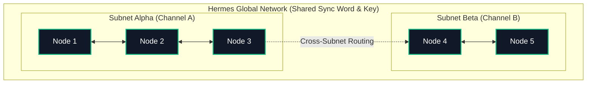

# 1. Introduction

**Hermes Link** is an AFSK1200 packet radio protocol primarily targeting limited digital transceivers such as the Quansheng UV-K5, TK11, and other Beken BK4819 radios.

The name _**Hermes Link**_ is inspired by **Hermes**, the Greek god of communication, travel, and boundaries, who served as the divine messenger of the Olympian gods. Known for his speed, cunning, and ability to move freely between worlds.

This specification aims to implement facilitated message authentication, mesh flooding, encryption, channel hopping, and other quality improvements compared to the original UV-K5 messenger.

## 1.1 Scope and Philosophy

We built Hermes to be fast, reliable, and accessible on affordable radio hardware. Existing digital protocols often require external TNCs or expensive proprietary hardware. Hermes runs natively on the BK4819's firmware, turning a $20 analog radio into a secure, digital mesh node.

## 1.2 Core Networking Concepts

To understand the Hermes Protocol, one must understand how it categorizes the actors within the RF space:

- **Node**: Any single radio device operating the Hermes firmware capable of receiving, decoding, and transmitting packets.
- **Network**: A collection of nodes sharing the exact same base configuration parameters (Keys, Sync Words, Timers). Nodes from different Networks cannot decode each other's packets.
- **Subnet**: A logical group or partition within a Network. Subnets allow nodes to communicate privately or in specific groups without establishing entirely new Networks.

In the subsequent sections of this RFC, we will break down the Hermes Protocol using an OSI-inspired model, starting from the physical RF layer up to the payload applications.
