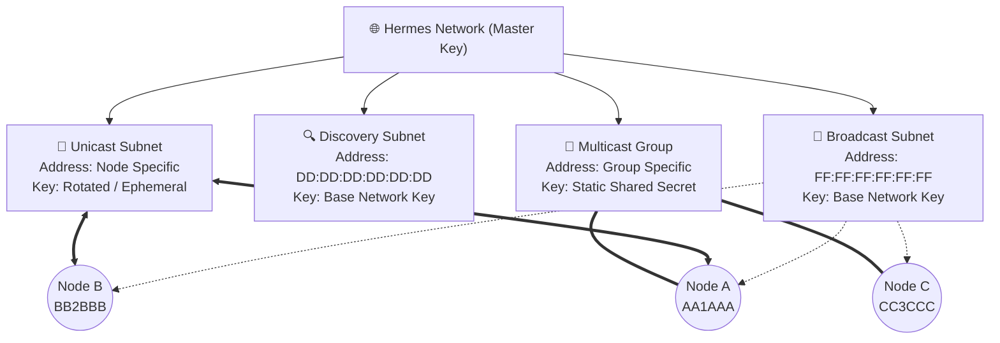
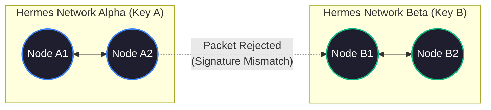
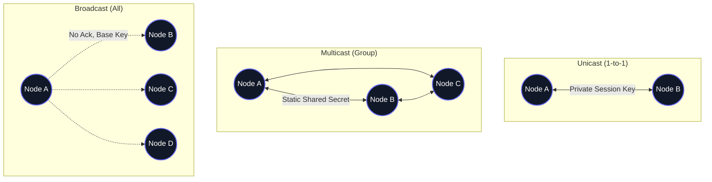

# 2. Architecture

The Hermes Link Protocol operates on multiple sub-levels, designed to function completely decentralized over the airwaves.

## 2.1 Addresses

Every node has a unique, identifying, **6-byte address**. Network subnets also utilize these 6-byte unique addresses for routing.

Addresses are used in the **Source** and **Destination** Header fields. A Unique Node Address can typically be derived directly from a 6-character ham radio callsign.

If specified in the Network or Subnet configuration, the Source field can be **sealed**, meaning it is encrypted inside the Packet Payload so passive listeners cannot see who initiated the packet.

## 2.2 Networks and Master Keys

All nodes belong to a **Network**. A Network possesses specifically tuned settings like timeouts, propagation behaviors, backoff timers, discovery intervals, keys, sealed sender settings, sync words, and more.

Because packets from other networks will have different keys and signatures, they cannot be handled by network nodes. Propagation or mesh flooding of a third party network's packets is mathematically impossible, as the TTL header property is signed with that specific network's key.

A **Master Network Key** forms the root of trust for all operations within a given Hermes network.

> **Legal Disclaimer:** To follow regulations against obscured communications in amateur radio bands, the default network operates under a fixed, null, default key (`0x00...`). It is the network operator's responsibility to adhere to encryption and obfuscation laws in their region by applying private keys only when legally permissible.

## 2.3 Subnets

A **Subnet** is a particular portion of the network that can employ dynamic keys (derived from the network key) that can evolve using ratcheting or other means of key rotation. 

There are four primary types of subnets:

### 2.3.1 Direct (Unicast) Subnets
In Unicast communication, **two nodes** operate on their own logical "subnet" in a half-duplex manner. Both the Sender and Destination addresses correspond directly to the respective Transmission and Receiving Node Unique Addresses.

Direct communication paths derive key material using ratcheting configurations or static deviations from the Master Key customized for specific node pairs.

### 2.3.2 Groups (Multicast) Subnets
Groups may use any Address for identification, so long as it is stored on all participating members as a registered Multicast Destination. Groups derive static shared secrets cryptographically from the Master Network Key and the Subnet Destination Address.

Keys function similarly to direct keys, but act as a static shared secret spanning multiple participant nodes rather than a rotating 1-to-1 session.

### 2.3.3 Broadcast Subnet
The Broadcast Subnet is a preset multicast destination explicitly for network-wide, uninhibited announcements.

- **Fixed Address:** `FF:FF:FF:FF:FF:FF`
- Broadcast packets are never acknowledged, sealed, or propagated blindly.
- Broadcasts do not perform key rotation or channel hopping.
- The Broadcast Key should remain the Base Network Key (or Null).
- The **Broadcast Channel** must be either Channel 1 of the frequency plan or a securely derived channel from the Network Key. Routine channel-hopping nodes must strictly exclude the Broadcast Channel from their rotation patterns.

### 2.3.4 Discovery Subnet
The Discovery Subnet functions strictly for nodes to announce their presence to local neighbors or network members.

- **Fixed Address:** `DD:DD:DD:DD:DD:DD`
- Exclusively dedicated to Discovery Packet types.
- Discovery packets contain node routing info, link telemetry data, and connection identification.
- The **Discovery Channel** must be either Channel 2 of the frequency plan or an explicitly derived channel (different from the Broadcast channel).
