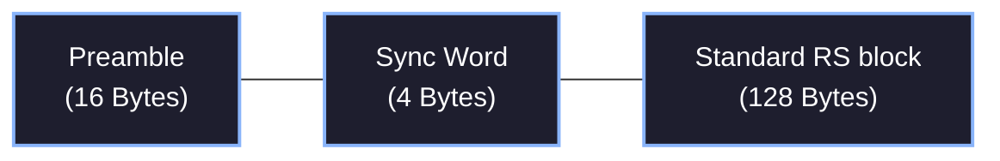

import PsdGraphMDX from '@/components/visualizer/PsdGraphMDX';
import SyncWordStatsMDX from '@/components/visualizer/SyncWordStatsMDX';
import AutocorrelationGraphMDX from '@/components/visualizer/AutocorrelationGraphMDX';
import PhysicalFrameVisualizerMDX from '@/components/visualizer/PhysicalFrameVisualizerMDX';
import OverheadChartMDX from '@/components/visualizer/OverheadChartMDX';
import { RadioTower, Cpu, Settings2, Sigma } from 'lucide-react';

# <RadioTower className="inline w-6 h-6 mr-2 text-blue-400" /> 3. Physical Layer

The Physical Layer defines the actual RF modulation settings applied directly to the BK4819 transceiver registers to operate the Hermes protocol.

## <Cpu className="inline w-5 h-5 mr-2 text-indigo-400" /> 3.1 FSK1200 Modulation

<PsdGraphMDX />

We configure the BK4819 for narrow-band FSK at **1.2 kbps** to maximize link margin. Running the baud rate incredibly low is the key enabler behind communicating through heavy noise floor environments under poor signal conditions.

FSK mode is engaged by writing `REG_58<0> = 1`. 

Both the Transmit and Receive clock sources are subsequently locked to the 1.2 kbps specification (`REG_58<15:10> = 000`).

```c
// BK4819 Transceiver FSK Setup (Kamilsss Firmware Implementation)
void BK4819_FskInit(void) {
    // FSK Enable, FSK 1.2K RX Bandwidth, Preamble 0xAA or 0x55
    BK4819_WriteRegister(BK4819_REG_58, 0x00C1);
    
    // Hardware settings and Payload length (72 bytes)
    BK4819_WriteRegister(BK4819_REG_5C, 0x5665);
    BK4819_WriteRegister(BK4819_REG_5D, 0x4700); 
    
    // Clear FIFOs and sync bits
    BK4819_WriteRegister(BK4819_REG_02, 0);
    BK4819_WriteRegister(BK4819_REG_3F, 0);
}
```

## <Settings2 className="inline w-5 h-5 mr-2 text-emerald-400" /> 3.2 FSK Frame Components

The baseline hardware FSK Frame structure operates in 3 distinct stages: Preamble, Sync Word, and Data Payload. To maximize Forward Error Correction efficiency, the Data Payload is transmitted as a single, contiguous 128-byte block.

| Field | Description |
|--------:|---------------:|
| **16 bytes**   | Preamble (0xAA or 0x55) |
| **4 bytes** | Sync Word (0x2F2A11DB) |
| **128 bytes** | Contiguous RS(128, 96) Codeword |



> **Performance Note:** We explicitly avoid hardware-level CRC and intra-codeword interleaving. The single RS(128, 96) block is mathematically optimal for correcting both localized bursts and scattered noise, provided it is coupled with physical-layer aware decoding.

## <Sigma className="inline w-5 h-5 mr-2 text-rose-400" /> 3.3 Sync Word & Preamble Configuration

<SyncWordStatsMDX />
<AutocorrelationGraphMDX />

### 3.3.1 Preamble 
A long preamble allows the receiver's AGC and bit-sync loops ample time to lock onto the incoming FSK transmission. 

We maximize the preamble to a full **16 bytes**.
We utilize either an alternating `0xAA` (`10101010`) or `0x55` (`01010101`) preamble pattern, cleanly depending on the Most Significant Bit of the first Sync Byte to ensure a pristine transition.

### 3.3.2 Sync Word
The Sync Word essentially acts as the "lock-on" identifier for the packet body. The hardware won't begin capturing the Data portion until it sees this exact byte sequence.

The default 4-byte Sync Word is a precisely calculated sequence: **`0x2F 0x2A 0x11 0xDB`**.

It acts as a high-entropy identifier with mathematically optimized auto-correlation properties derived to minimize the chances of false-positives against ambient RF noise.

## 3.4 Link Quality Telemetry (Soft Decisions)

To enable advanced **Erasure Decoding**, the receiver must generate soft-decision metrics during the reception of the 128-byte payload. The firmware polls the BK4819 internal diagnostic registers via SPI for every byte received during the RX interrupt.

- **RSSI (Reg 67)**: Monitoring signal strength for deep RF fades.
- **Glitch (Reg 63)**: High-speed indicator of clock desynchronization and bit-errors.
- **Ex-Noise (Reg 65)**: Detects non-FSK energy and interference spikes.
- **Erasure Mapping**: If the RSSI drops below threshold, Glitch count spikes, or Ex-Noise indicates heavy interference during a specific window, the corresponding bytes in the 128-byte array are flagged as mathematical **erasures**.

By supplying these hardware-derived flags to the L2 decoder, the protocol's burst correction limit is doubled from 16 to **32 bytes**.

## 3.5 Interactive Visualizer: Frame Structure

The entire FSK1200 frame layout, from Preamble to Signature and Parity bytes, is physically illustrated below in relative size mappings.

<PhysicalFrameVisualizerMDX />

### Framing Overhead Analysis

Because the baud rate is aggressively low (1.2 kbps), airtime is heavily constrained. The chart below explicitly maps the bytes attributed to Application payload vs the overhead needed to physically route, encode, and transmit the data securely.

<OverheadChartMDX />
