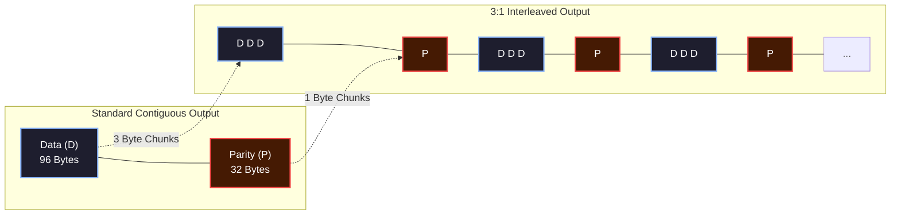
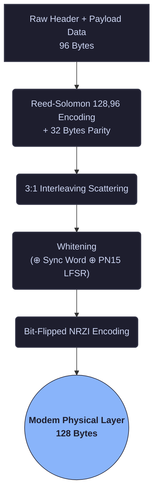

import InterleavingVisualizerMDX from '@/components/visualizer/InterleavingVisualizerMDX';
import WhiteningVisualizerMDX from '@/components/visualizer/WhiteningVisualizerMDX';
import { Layers, ShieldCheck, Shuffle, Webhook, Zap, Route } from 'lucide-react';

# <Layers className="inline w-6 h-6 mr-2 text-blue-400" /> 4. Data Link Layer (L2)

The Data Link Layer is responsible for ensuring the mathematical integrity of the packet body before it reaches the Transport layer rules. This covers heavy error-correction, scrambling for baseline DC neutrality, and run-length encoding.

## <ShieldCheck className="inline w-5 h-5 mr-2 text-indigo-400" /> 4.1 Forward Error Correction (FEC)

The full 128 bytes of overhead Data payload generated by the Physical layer are forward error corrected using **Reed-Solomon(128, 96)**. 

RS(128, 96) implies there are:
- 96 bytes of true Application / Routing Data
- 32 bytes of Parity (Error-Correction overhead)

This configuration grants the algorithm the capability of safely correcting up to **16 symbol errors** (roughly 12.5% of the total packet footprint). For all practical purposes, the probability that a random RF noise error inside the codeword appears valid (and isn't rejected) is mathematically `2^-256`.

### 4.1.2 Recommended Processing Library
Any library supporting Reed-Solomon FEC with syndrome checking is compatible. 

For embedded systems such as the BK4819/UV-K5, the recommended lightweight library is:
> [sq8vps/lwfec](https://github.com/sq8vps/lwfec) - Lightweight C99 FEC library

```c
// Hermes RS(128,96) Forward Error Correction
#include "rs.h"

void Hermes_EncodeRS(uint8_t* tx_buffer) {
    // Initialize RS struct for 8-bit symbols, 32 parity bytes
    // (n=128, k=96)
    void *rs = init_rs_char(8, 0x11d, 0, 1, 32, 0);
    
    // tx_buffer contains the 96-byte packet payload.
    // encode_rs_char() calculates and appends the 32 parity bytes 
    // to the end of the buffer (total 128 bytes).
    encode_rs_char(rs, tx_buffer, &tx_buffer[96]);
    
    free_rs_char(rs);
}
```

## <Shuffle className="inline w-5 h-5 mr-2 text-emerald-400" /> 4.2 Interleaving 

<InterleavingVisualizerMDX />

To mitigate burst errors (where a sudden blast of static wipes out an entire contiguous row of bytes), the protocol applies **3:1 Interleaving** to the RS(128,96) data blocks.

Instead of writing all 96 data bytes, followed linearly by the 32 parity bytes, the stream is mixed:
- We insert **1 parity byte** after each **3-byte data block**.

This interleaving scatters the parity checksums across the physical transmission timeline, protecting the structural integrity from concentrated RF bursts.




## <Webhook className="inline w-5 h-5 mr-2 text-rose-400" /> 4.3 Whitening (Scrambling)

<WhiteningVisualizerMDX />

FSK1200 decoders struggle if they see heavy repetitions of static sequences (DC biasing). To maintain balanced RF energy and zero-DC average across the packet, we whiten (scramble) the interleaved 128 bytes.

The payload is Whitened through an XOR operation (`⊕`) across two properties:
1. **The 4-Byte Sync Word**
2. **A PN15 LFSR Sequence** (Linear-Feedback Shift Register using polynomial $x^{15} + x^{14} + 1$)

This process ensures that even if you send a payload entirely consisting of `0x00`, the RF transmission looks completely random.

```c
// Hermes PN15 LFSR Whitening (C Implementation)
void Hermes_Whiten(uint8_t* buffer, uint32_t sync_word) {
    // Seed LFSR with Sync Word
    uint16_t lfsr = sync_word & 0xFFFF;
    if (lfsr == 0) lfsr = 0xFFFF; // LFSR cannot be 0
    
    for (int i = 0; i < 128; i++) {
        uint8_t scramble_byte = 0;
        
        // Generate 8 bits of pseudo-random noise
        for (int b = 0; b < 8; b++) {
            // Polynomial: x^15 + x^14 + 1
            uint16_t bit = ((lfsr >> 0) ^ (lfsr >> 1)) & 1;
            lfsr = (lfsr >> 1) | (bit << 14);
            
            scramble_byte = (scramble_byte << 1) | bit;
        }
        
        // XOR the buffer in-place
        buffer[i] ^= scramble_byte;
    }
}
```

## <Zap className="inline w-5 h-5 mr-2 text-amber-400" /> 4.4 NRZI Encoding

Even after whitening, long runs of zeroes or ones can inadvertently cause the receiver clock to desync. The final phase before sending the byte stream down to the modem is encoding it utilizing **bit-flipped NRZI** (Non-Return-to-Zero Inverted).

- A `0` bit triggers a **Transition** (voltage swing).
- A `1` bit triggers **No Transition**.

Because the whitening pass guarantees the data heavily swings between `0` and `1`, NRZI ensures frequent enough transitions to maintain receiver clock synchronization.

---

## <Route className="inline w-5 h-5 mr-2 text-neutral-400" /> Complete Action Pipeline (Tx)

When generating a packet, the pipeline follows a strict downward flow:


