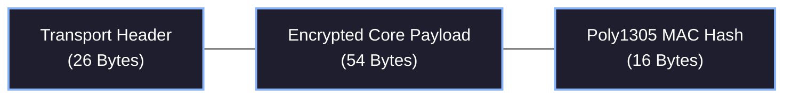

# 5. Transport Layer (L3/L4)

While the Data Link Layer ensures the `0`s and `1`s transmitted match the data received perfectly, the Transport Layer manages *what* to do with that packet data. This encompasses addressing, identifying the packet payload type, handling fragmentations, tracking mesh TTL lifetimes, and generating cryptographic nonces.

Every Hermes packet follows a strict binary format to maximize Transport Layer efficiency and routing capabilities within the 128-byte encoded window.

## 5.1 The 26-Byte Header

The Transport Header uniformly consists of 26 crucial bytes used for protocol interpretation and routing constraints. 

These 26 bytes exist precisely inside the 96 available data payload bytes (with 54 remaining for the actual specific Payload application and 16 remaining for the cryptographic signature!).

| Field | Size | Details |
|---:|---:|---|
| **Type** | 5 bits | Ranges from 0-31, identifying the packet type (e.g., ACK, PING, MESG) |
| **Time to Live** | 3 bits | Remaining mesh flood hops allowed (0 = Exhausted) |
| **Addressing** | 2 bits | 0=Unicast, 1=Multicast, 2=Broadcast, 3=Discover |
| **Want Ack** | 1 bit | `1` indicates destination node must reply with an ACK |
| **Fragment Index** | 4 bits | Index 0-15 allowing up to 16 joined frames per message |
| **Last Fragment** | 1 bit | `1` marks the final packet piece ending a chunk transfer |
| **Nonce** | 12 bytes | 96-bit True Random Number serving as an Initialization Vector (IV) |
| **Destination** | 6 bytes | Target Node or Subnet 6-character Hash |
| **Source** | 6 bytes | Sender Node 6-character Hash |

### 5.1.2 Addressing Constraints
Different `Addressing` flags impact the validity of other header fields:
- If `Addressing` is `Broadcast (2)` or `Discover (3)`, `Want Ack` is typically illegal and ignored, as a single generic destination answering back simultaneously would violently jam the network.
- `Time to Live (TTL)` limits infinite loop forwarding on dense mesh networks where loops can cause catastrophic, unending transmission storms.

### 5.1.3 The IV Nonce
Packet headers contain a 12-byte (96-bit) **Nonce**. This is typically derived from hardware True Random Number Generators (TRNGs) combined with entropy sources such as internal RF noise or clock drift.

This nonce acts as the Initialization Vector (IV) for the ChaCha20 cipher blocks processing the interior payload. 
It guarantees that even if a node sends the exact sequence of bytes to the same destination one hundred times, the encrypted payload blocks (and subsequent signatures) will be entirely distinct, inherently circumventing replay attacks and enforcing cipher uniqueness.

### 5.1.4 Visual Example: Transport Header Detailed Expansion

The interactive component below maps out a standard `26-byte` Hermes transport layer header, explicitly mapping out the bits for the control flags.

import HeaderVisualizerMDX from '@/components/visualizer/HeaderVisualizerMDX';

<HeaderVisualizerMDX />
