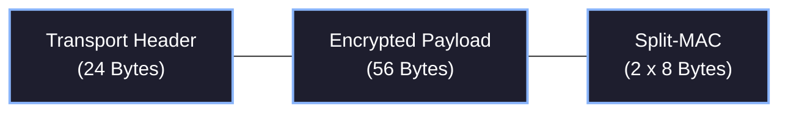

# 5. Transport Layer (L3/L4)

While the Data Link Layer ensures the `0`s and `1`s transmitted match the data received perfectly, the Transport Layer manages *what* to do with that packet data. This encompasses addressing, identifying the packet payload type, handling fragmentations, tracking mesh TTL lifetimes, and generating cryptographic nonces.

Every Hermes packet follows a strict binary format to maximize Transport Layer efficiency and routing capabilities within the 128-byte encoded window.

## 5.1 The 24-Byte Header

The Transport Header uniformly consists of 24 crucial bytes used for protocol interpretation and routing constraints. 

These 24 bytes exist inside the 96 available data payload bytes (with 56 remaining for the core payload and 16 remaining for the "Split-MAC" cryptographic signatures).

| Field | Size | Details |
|---:|---:|---|
| **Type** | 4 bits | Identifies the packet application payload type |
| **Time to Live** | 4 bits | Remaining mesh flood hops allowed (0 = Exhausted) |
| **Addressing** | 2 bits | 0=Unicast, 1=Multicast, 2=Broadcast, 3=Discover |
| **Want Ack** | 1 bit | `1` indicates destination node must reply with an ACK |
| **Fragment Index** | 4 bits | Index 0-15 for fragmented messages |
| **Last Fragment** | 1 bit | `1` marks the final packet piece |
| **Packet ID** | 6 bytes | Globally unique identifier (static across TTL hops) |
| **Destination** | 6 bytes | Target Node or Subnet Hash |
| **Source** | 6 bytes | Sender Node Hash (Encrypted by Traffic Key) |
| **Hop Nonce** | 4 bytes | Per-hop randomization (updates on every re-sign) |

### 5.1.2 Addressing Constraints
Different `Addressing` flags impact the validity of other header fields:
- If `Addressing` is `Broadcast (2)` or `Discover (3)`, `Want Ack` is typically illegal and ignored, as a single generic destination answering back simultaneously would violently jam the network.
- `Time to Live (TTL)` limits infinite loop forwarding on dense mesh networks where loops can cause catastrophic, unending transmission storms.

### 5.1.3 Implicit & Double-Layer Nonces
Packet headers no longer store a literal 12-byte nonce. Instead, nodes compute **Implicit Nonces** for both End-to-End (E2E) encryption and Hop-by-Hop (HBH) authentication:

1. **Inner IV (E2E)**: Derived from the 6-byte `Packet ID` and 6-byte `Destination`. Stays static perfectly from sender to receiver.
2. **Outer IV (HBH)**: Derived from the 8-byte `Inner MAC` and 4-byte `Hop Nonce`. This changes at every router.

This mechanism ensures that the payload stays static for deduplication, yet is completely scrambled on the wire at every hop to defeat traffic analysis.

### 5.1.4 Visual Example: 24-byte Header
The interactive component below maps out the updated 24-byte Hermes transport layer header.

import HeaderVisualizerMDX from '@/components/visualizer/HeaderVisualizerMDX';

<HeaderVisualizerMDX />
