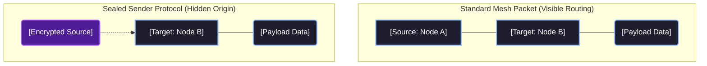

import InteractiveEntropyGraphMDX from '@/components/visualizer/InteractiveEntropyGraphMDX';
import AvalancheVisualizerMDX from '@/components/visualizer/AvalancheVisualizerMDX';
import { Lock, FileKey2, Network, EyeOff } from 'lucide-react';

# <Lock className="inline w-6 h-6 mr-2 text-blue-400" /> 6. Cryptographic Security

Hermes Link assures confidentiality and integrity across the mesh network using modern cryptographic standards optimized strictly for constrained embedded devices. These rules run closely aligned with the Transport Layer mechanics.

## <FileKey2 className="inline w-5 h-5 mr-2 text-indigo-400" /> 6.1 ChaCha20-Poly1305 AEAD

<InteractiveEntropyGraphMDX />

The protocol leans heavily on **RFC 7539** guidelines, implementing `ChaCha20` for symmetric stream cipher encryption across the Payload and `Poly1305` for hashing in an **Authenticated Encryption with Associated Data (AEAD)** construct.

For signatures and encryption computations, standard library routines are optimal. For constrained platforms such as the Beken B4819 MCUs or bare metal systems, utilizing simple C99 implementations is standard:

> [grigorig/chachapoly](https://github.com/grigorig/chachapoly) - Lightweight ChaCha20-Poly1305 in C99

```c
// Hermes ChaCha20-Poly1305 AEAD Encryption Payload
#include "chachapoly.h"

void Hermes_EncryptPayload(
    const uint8_t* master_key,   // 32-byte network key
    const uint8_t* header_nonce, // 12-byte nonce from header
    const uint8_t* header_aead,  // 26-byte authenticated header data
    uint8_t* payload,            // 54-byte plaintext payload (in-place encryption)
    uint8_t* out_mac             // 16-byte Poly1305 output tag
) {
    chachapoly_ctx ctx;
    chachapoly_init(&ctx, master_key, header_nonce);
    
    // 1. Authenticate the unencrypted Header (Associated Data)
    chachapoly_update_aad(&ctx, header_aead, 26);
    
    // 2. Encrypt the Message Payload in-place
    chachapoly_crypt(&ctx, payload, 54);
    
    // 3. Generate the final 16-byte MAC Signature
    chachapoly_finish(&ctx, out_mac);
}
```

## <Network className="inline w-5 h-5 mr-2 text-emerald-400" /> 6.2 Packet Signatures

<AvalancheVisualizerMDX />

Packet signatures prevent active tampering from "man in the middle" bad actors, completely stopping attempts at manipulating headers (such as `TTL` extensions or `Destination` substitutions) and asserting strict authenticity.

The protocol consumes the final 16 bytes of the total 96-byte layer window for the **Poly1305 Signature Hash**.

The Poly1305 AEAD hash string is constructed securely over:
1. **The Header** (26 Bytes)
2. **The Output Ciphertext Payload** (54 Bytes) 
3. **The Pre-shared Secret Key** (32 Bytes)

A node immediately discards incoming packets resulting in signature comparison mismatches. This directly prevents invalidly routed packets, artificially inflated nonces, or maliciously scrambled data strings from stealing CPU processing power beyond the validation check.

## 6.3 Master Key Mechanics

A **Base Network Key** dictates the fundamental root-of-trust over a mesh. Since an identical base key is required to correctly compute the Poly1305 match criteria across the header fields, any packets derived from an incompatible network key are safely ignored as raw noise.

### Subnet Key Derivation
Keys for internal subnets and 1-to-1 ratcheted Unicast sessions deviate mathematically from this original Base Network root structure.

> **Zero Trust Fallback:** Legal regulations governing amateur radio heavily restrict cipher-obfuscated data in transit. In compliant operating zones, the `Master Network Key` utilizes a publicly known `NULL` state sequence (`0x00...`). 

## 6.4 Sealed Sender Implementations

When active at the network level, the Hermes protocol can employ **"Sealed Sender"** dynamics.

By default, an eavesdropper looking at the Network Layer headers can openly observe the `Destination` address alongside the corresponding 6-character `Source` Address.

When Sealed Sender behavior activates, the final 6 bytes of the Header array are physically relocated into the ChaCha20 cipher cycle along with the `Payload`.

While the passive eavesdropper can intercept the packet and realize some address (`Destination`) is the intended recipient of a mesh broadcast, it is mathematically impossible to glean which node physically originated the packet inside the network structure.


