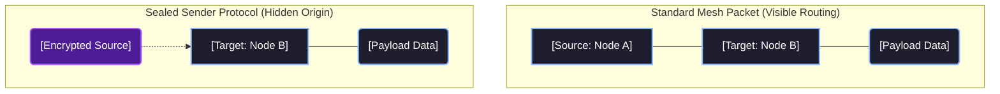
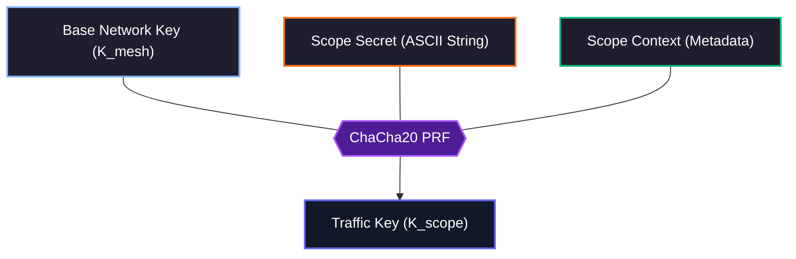

import InteractiveEntropyGraphMDX from '@/components/visualizer/InteractiveEntropyGraphMDX';
import AvalancheVisualizerMDX from '@/components/visualizer/AvalancheVisualizerMDX';
import { Lock, FileKey2, Network, EyeOff, ShieldCheck } from 'lucide-react';

# <Lock className="inline w-6 h-6 mr-2 text-blue-400" /> 6. Cryptographic Security

Hermes Link provides confidentiality and integrity across the mesh network using cryptographic standards optimized for constrained embedded devices. These rules align with the Transport Layer mechanics.

## <FileKey2 className="inline w-5 h-5 mr-2 text-indigo-400" /> 6.1 ChaCha20-Poly1305 AEAD

<InteractiveEntropyGraphMDX />

The protocol leans heavily on **RFC 7539** guidelines, implementing `ChaCha20` for symmetric stream cipher encryption across the Payload and `Poly1305` for hashing in an **Authenticated Encryption with Associated Data (AEAD)** construct.

For signatures and encryption computations, standard library routines are optimal. For constrained platforms such as the Beken B4819 MCUs or bare metal systems, utilizing simple C99 implementations is standard:

> [grigorig/chachapoly](https://github.com/grigorig/chachapoly) - Lightweight ChaCha20-Poly1305 in C99

```c
// Hermes ChaCha20-Poly1305 AEAD Encryption Payload
#include "chachapoly.h"

void Hermes_EncryptPayload(
    const uint8_t* master_key,   // 32-byte network key
    const uint8_t* header_nonce, // 12-byte nonce from header
    const uint8_t* header_aead,  // 26-byte authenticated header data
    uint8_t* payload,            // 54-byte plaintext payload (in-place encryption)
    uint8_t* out_mac             // 16-byte Poly1305 output tag
) {
    chachapoly_ctx ctx;
    chachapoly_init(&ctx, master_key, header_nonce);
    
    // 1. Authenticate the unencrypted Header (Associated Data)
    chachapoly_update_aad(&ctx, header_aead, 26);
    
    // 2. Encrypt the Message Payload in-place
    chachapoly_crypt(&ctx, payload, 54);
    
    // 3. Generate the final 16-byte MAC Signature
    chachapoly_finish(&ctx, out_mac);
}
```

## <Network className="inline w-5 h-5 mr-2 text-emerald-400" /> 6.2 Packet Signatures

<AvalancheVisualizerMDX />

Packet signatures prevent active tampering from "man in the middle" actors, preventing unauthorized manipulation of headers (such as `TTL` extensions or `Destination` substitutions) and asserting authenticity.

The protocol consumes the final 16 bytes of the total 96-byte layer window for the **Poly1305 Signature Hash**.

The Poly1305 AEAD hash string is constructed securely over:
1. **The Header** (26 Bytes)
2. **The Output Ciphertext Payload** (54 Bytes) 
3. **The Pre-shared Secret Key** (32 Bytes)

A node immediately discards incoming packets resulting in signature comparison mismatches. This directly prevents invalidly routed packets, artificially inflated nonces, or maliciously scrambled data strings from stealing CPU processing power beyond the validation check.

## 6.3 Master Key Mechanics

A **Base Network Key** dictates the fundamental root-of-trust over a mesh. Since an identical base key is required to correctly compute the Poly1305 match criteria across the header fields, any packets derived from an incompatible network key are safely ignored as raw noise.

### Subnet Key Derivation
Keys for internal subnets and 1-to-1 ratcheted Unicast sessions deviate mathematically from this original Base Network root structure.

> **Zero Trust Fallback:** Legal regulations governing amateur radio heavily restrict cipher-obfuscated data in transit. In compliant operating zones, the `Master Network Key` utilizes a publicly known `NULL` state sequence (`0x00...`). 

## 6.4 Sealed Sender Implementations

When active at the network level, the Hermes protocol can employ **"Sealed Sender"** dynamics.

By default, an eavesdropper looking at the Network Layer headers can openly observe the `Destination` address alongside the corresponding 6-character `Source` Address.

When Sealed Sender behavior activates, the final 6 bytes of the Header array are physically relocated into the ChaCha20 cipher cycle along with the `Payload`.

While an observer can intercept the packet and identify the destination, they cannot determine which node originated the packet without the appropriate keys.



## <ShieldCheck className="inline w-5 h-5 mr-2 text-orange-400" /> 6.5 Secret Compartmentalization

To provide cryptographic isolation within a shared mesh network, Hermes utilizes **Secret Compartmentalization** for Unicast and Multicast traffic (but specifically excludes Discovery and Broadcast). This ensures that even if an attacker possesses the Base Network Key ($K_{mesh}$), they cannot decrypt private traffic without the specific **Scope Secret**.

This mechanism provides cryptographic separation between different communication scopes. The traffic key depends on data unknown to other mesh participants.

### Key Derivation ($K_{scope}$)

The session-specific traffic key ($K_{scope}$) is derived using **ChaCha20** as a Pseudo-Random Function (PRF). By using the network key as the PRF entropy source and the secret/context as the message, we derive a unique key for the specific scope.



#### Scope Context Specification

The `scope_context` ensures domain separation between different communication types and specific node pairings.

| Field | Size | Details |
|---:|---:|---|
| **Scope Secret** | variable | User-defined ASCII string (e.g. "my-secret-group") |
| **Scope Label** | 1 Byte | `U` (0x55) for Unicast, `M` (0x4D) for Multicast |
| **Sender** | 6 Bytes | 6-char source address hash |
| **Destination** | 6 Bytes | 6-char destination address hash |

#### PRX Pseudocode (ChaCha20)

```c
/**
 * Derives a 32-byte K_scope from the mesh key and context.
 * We use the first 32 bytes of the ChaCha20 keystream generated 
 * from the K_mesh (key) and context (nonce/message).
 */
void Hermes_DeriveScopeKey(
    const uint8_t* k_mesh,        // 32-byte network key
    const char* scope_secret,     // "scope_secret"
    uint8_t scope_label,          // 'U' or 'M'
    const uint8_t* sender,        // 6-byte source
    const uint8_t* destination,   // 6-byte dest
    uint8_t* out_k_scope          // Resulting 32-byte key
) {
    uint8_t input_block[64] = {0};
    
    // 1. Construct the context message
    // Format: [Label][Sender][Dest][Secret...]
    input_block[0] = scope_label;
    memcpy(input_block + 1, sender, 6);
    memcpy(input_block + 7, destination, 6);
    strncpy((char*)input_block + 13, scope_secret, 50); // Up to 50 chars

    // 2. PRF: Generate keystream block 0 using K_mesh
    // Nonce is fixed to zero for the PRF phase
    uint8_t zero_nonce[12] = {0};
    uint8_t zero_plaintext[32] = {0};
    
    chachapoly_ctx ctx;
    chachapoly_init(&ctx, k_mesh, zero_nonce);
    
    // We "encrypt" the input_block (or just use it to shift the state)
    // To keep it simple: we use the input_block as the AAD to influence the state
    chachapoly_update_aad(&ctx, input_block, 64);
    
    // Use the resulting keystream to generate the new key
    chachapoly_crypt(&ctx, zero_plaintext, 32); 
    memcpy(out_k_scope, zero_plaintext, 32);
}
```


### The "Sealed Sender" Paradox

A "paradox" occurs when Secret Compartmentalization is used in conjunction with **Sealed Sender** (Section 6.4). 

1.  **Dependency**: To derive $K_{scope}$, you need the `Sender Address`.
2.  **Sealing**: The `Sender Address` is encrypted (sealed) *using* $K_{scope}$.
3.  **Result**: You cannot identify the sender without the key, and you cannot get the key without the sender ID.

#### Resolution: Contact Iteration

To resolve this circular dependency, a receiving node performs the following check for incoming sealed unicast/multicast packets:

```c
for (contact in known_contacts) {
    // 1. Assume this contact is the sender
    K_trial = PRF(K_mesh, contact.secret, 'U', contact.addr, my_addr);
    
    // 2. Attempt decryption and MAC verification
    if (AEAD_Verify(K_trial, packet)) {
        // Success! Sender identified as 'contact'
        return contact;
    }
}
// If all fail, packet is invalid or from an unknown secret scope
```

This logic enforces sender anonymity within the network. An observer may see a packet's destination but cannot identify the sender without access to the secrets of the network participants.

