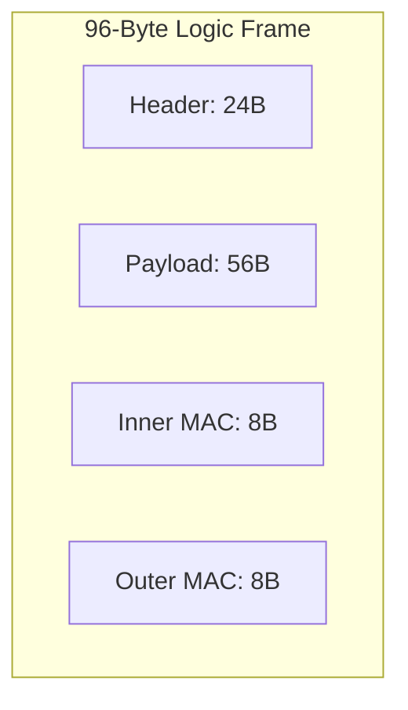
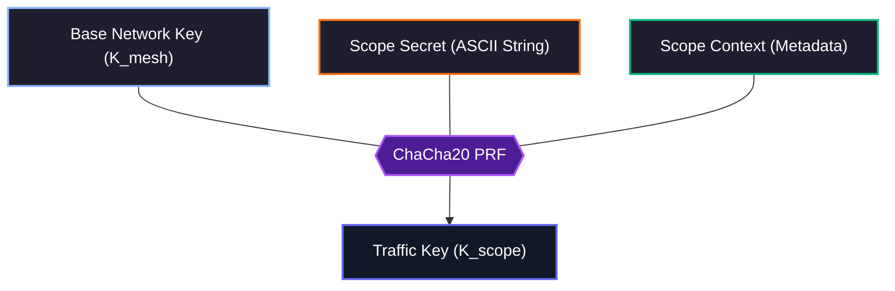

import NestedTrustVisualizerMDX from '@/components/visualizer/NestedTrustVisualizerMDX';
import AvalancheVisualizerMDX from '@/components/visualizer/AvalancheVisualizerMDX';
import { Lock, FileKey2, Network, EyeOff, ShieldCheck } from 'lucide-react';

# <Lock className="inline w-6 h-6 mr-2 text-blue-400" /> 6. Cryptographic Security

Hermes Link provides confidentiality and integrity across the mesh network using cryptographic standards optimized for constrained embedded devices. These rules align with the Transport Layer mechanics.

## <FileKey2 className="inline w-5 h-5 mr-2 text-indigo-400" /> 6.1 ChaCha20-Poly1305 AEAD

<NestedTrustVisualizerMDX />

The protocol implements a **Nested Trust** model using `ChaCha20` for symmetric stream cipher encryption and `Poly1305` for hashing in an **Authenticated Encryption with Associated Data (AEAD)** construct.

Uniquely, Hermes Link splits encryption and authentication into two distinct layers:

1.  **Inner Layer (End-to-End):** Secures the payload and masks the sender's identity using the **Scope Traffic Key**.
2.  **Outer Layer (Hop-by-Hop):** Authenticates the header and obfuscates the entire packet using the **Base Network Key**.

### 6.1.1 Split-MAC Structure (8 + 8 Bytes)

Instead of a single 16-byte signature, Hermes consumes the final 16 bytes for two truncated MACs:

| Field | Size | Key Used | Verified By |
| --- | --- | --- | --- |
| **Inner MAC** | 8 Bytes | Traffic Key ($K_{scope}$) | Final Destination |
| **Outer MAC** | 8 Bytes | Network Key ($K_{mesh}$) | Every Hop (Routers) |



### 6.1.2 The "Honey-Token" (Signature Chaining)

To prevent "Header Injection" attacks (where an attacker tries to swap valid headers onto different payloads), the **Outer IV** is mathematically tied to the **Inner MAC**:

- **Outer IV** = `[Inner MAC (8 bytes)]` + `[Hop Nonce (4 bytes)]`

This creates a cryptographic chain. If the payload is modified, the Inner MAC changes; if the Inner MAC changes, the Outer IV changes; if the Outer IV changes, the Outer MAC (routing signature) becomes invalid.

## <Network className="inline w-5 h-5 mr-2 text-emerald-400" /> 6.2 Packet Signatures

<AvalancheVisualizerMDX />

Packet signatures prevent active tampering and provide per-hop validation. Because the **Outer MAC** is verified by intermediate routers, tampered headers or invalidly routed packets are discarded immediately before they can waste network airtime.

A node immediately discards incoming packets resulting in signature comparison mismatches. This provides **Tamper Detection Intelligence**:
- **Outer MAC Failure:** Indicates radio interference or an unauthorized node attempting to inject packets into the mesh without the $K_{mesh}$.
- **Inner MAC Failure (at destination):** Indicates a "compromised router" attack (Ghost Router). The mesh delivered the packet correctly ($K_{mesh}$ verified), but the application data was altered in transit.

## 6.3 Master Key Mechanics

A **Base Network Key** dictates the fundamental root-of-trust over a mesh. Since an identical base key is required to correctly compute the Poly1305 match criteria across the header fields, any packets derived from an incompatible network key are safely ignored as raw noise.

### Subnet Key Derivation
Keys for internal subnets and 1-to-1 ratcheted Unicast sessions deviate mathematically from this original Base Network root structure.

> **Zero Trust Fallback:** Legal regulations governing amateur radio heavily restrict cipher-obfuscated data in transit. In compliant operating zones, the `Master Network Key` utilizes a publicly known `NULL` state sequence (`0x00...`). 

## 6.4 Sealed Sender Implementations

When active, the Hermes protocol employs **Always-On Sealed Sender** dynamics. By default, the `Traffic Key` ($K_{scope}$) encrypts both the application payload and the 6-byte `Source` address.

While an observer can intercept the packet and identify the destination (since routing nodes need cleartext destinations to forward correctly), they cannot determine which node originated the packet or what is inside it without the appropriate keys.

## <ShieldCheck className="inline w-5 h-5 mr-2 text-orange-400" /> 6.5 Secret Compartmentalization

To provide cryptographic isolation within a shared mesh network, Hermes utilizes **Secret Compartmentalization** for Unicast and Multicast traffic (but specifically excludes Discovery and Broadcast). This ensures that even if an attacker possesses the Base Network Key ($K_{mesh}$), they cannot decrypt private traffic without the specific **Scope Secret**.

This mechanism provides cryptographic separation between different communication scopes. The traffic key depends on data unknown to other mesh participants.

### Key Derivation ($K_{scope}$)

The session-specific traffic key ($K_{scope}$) is derived using **ChaCha20** as a Pseudo-Random Function (PRF). By using the network key as the PRF entropy source and the secret/context as the message, we derive a unique key for the specific scope.



#### Scope Context Specification

The `scope_context` ensures domain separation between different communication types and specific node pairings.

| Field | Size | Details |
|---:|---:|---|
| **Scope Secret** | variable | User-defined ASCII string (up to 57 bytes) |
| **Scope Label** | 1 Byte | `U` (Unicast), `M` (Multicast), `B` (Broadcast), `D` (Discovery) |
| **Destination** | 6 Bytes | 6-char destination address hash |

#### PRX Pseudocode (ChaCha20)

```c
/**
 * Derives a 32-byte K_scope from the mesh key and context.
 * We use the first 32 bytes of the ChaCha20 keystream generated 
 * from the K_mesh (key) and context (nonce/message).
 */
void Hermes_DeriveScopeKey(
    const uint8_t* k_mesh,        // 32-byte network key
    const char* scope_secret,     // "scope_secret" (NULL for B/D)
    uint8_t scope_label,          // 'U', 'M', 'B', or 'D'
    const uint8_t* destination,   // 6-byte dest
    uint8_t* out_k_scope          // Resulting 32-byte key
) {
    uint8_t input_block[64] = {0};
    
    // 1. Construct the context message
    // Format: [Label][Dest][Secret...]
    input_block[0] = scope_label;
    memcpy(input_block + 1, destination, 6);
    strncpy((char*)input_block + 7, scope_secret, 57); // Up to 57 chars

    // 2. PRF: Generate keystream block 0 using K_mesh
    // Nonce is fixed to zero for the PRF phase
    uint8_t zero_nonce[12] = {0};
    uint8_t zero_plaintext[32] = {0};
    
    chachapoly_ctx ctx;
    chachapoly_init(&ctx, k_mesh, zero_nonce);
    
    // We "encrypt" the input_block (or just use it to shift the state)
    // To keep it simple: we use the input_block as the AAD to influence the state
    chachapoly_update_aad(&ctx, input_block, 64);
    
    // Use the resulting keystream to generate the new key
    chachapoly_crypt(&ctx, zero_plaintext, 32); 
    memcpy(out_k_scope, zero_plaintext, 32);
}
```

### 6.5.1 NULL Secrets for Public Traffic

For **Broadcast** ('B') and **Discovery** ('D') packets, the `scope_secret` is defined as a fixed sequence of null bytes. This ensures that the Traffic Key mechanism remains universal across all Hermes communication types while allowing public traffic to be decrypted by any node possessing the Base Network Key ($K_{mesh}$).

| Type | Label | Secret Requirement |
| :--- | :--- | :--- |
| **Unicast** | `U` (0x55) | Pre-shared Contact Secret |
| **Multicast** | `M` (0x4D) | Pre-shared Group Secret |
| **Broadcast** | `B` (0x42) | `NULL` (All Zeros) |
| **Discovery** | `D` (0x44) | `NULL` (All Zeros) |


### Solving the "Sealed Sender" Paradox

By removing the **Source** (Sender) from the input context of $K_{scope}$, we eliminate the circular dependency. 

1.  **Direct Decryption**: The receiver knows the **Destination** address (it is cleartext).
2.  **Key Retrieval**: The receiver looks up the `Scope Secret` associated with that destination and derives $K_{scope}$ immediately.
3.  **Unmasking**: $K_{scope}$ is used to decrypt the header (revealing the **Sender ID**) and the payload.

This architecture ensures that even with a fully masked sender, the destination can decrypt the packet in a single pass without expensive trial-decryption across all known contacts.

