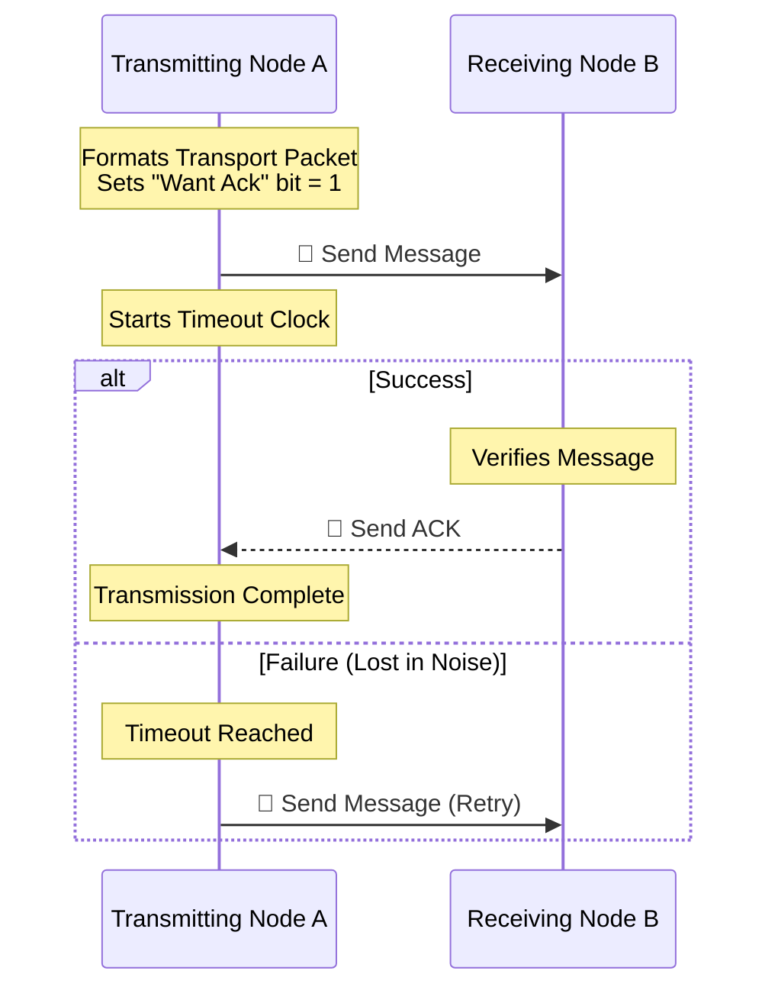
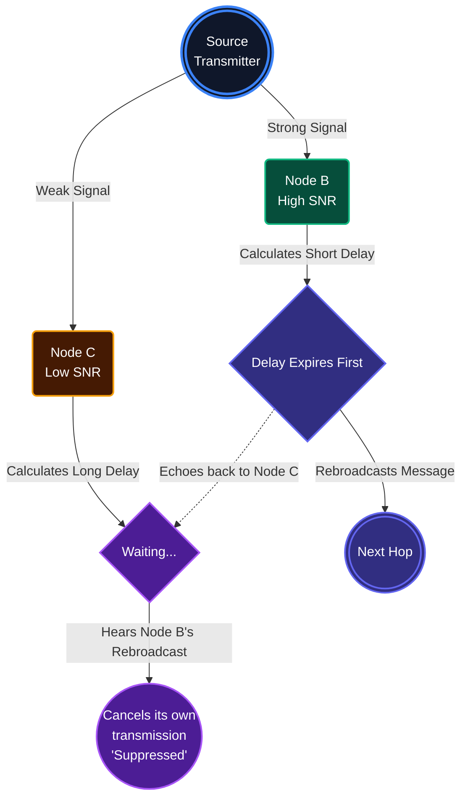

import { LocateFixed, RadioReceiver, Network, Activity } from 'lucide-react';

# <LocateFixed className="inline w-6 h-6 mr-2 text-blue-400" /> 7. Routing & Addressing Behaviors

Hermes Link behaves primarily as a decentralized mesh. Transmitting nodes cannot guarantee line-of-sight to the end recipient across dense environments, meaning they rely on the network to flood data successfully across the ether until it hits its proper destination. 

## <RadioReceiver className="inline w-5 h-5 mr-2 text-indigo-400" /> 7.1 Address Identifiers

Regardless of routing specifics, nodes determine packet handling based on the combination of the 6-byte **Source** and 6-byte **Destination** hash codes found in the Transport Layer Header arrays.

Addressing behavior changes distinctly between single target (Unicast) and multi-target (Multicast/Broadcast) routing requests.

## <Activity className="inline w-5 h-5 mr-2 text-emerald-400" /> 7.2 Unicast Routing (1-to-1)

Unicast traffic operates securely between exactly two nodes. It uses a **Stop-and-Wait ARQ** model. This simply means: **"I will send a message and wait for you to reply that you got it. If you don't reply, I will send it again."**

## <Network className="inline w-5 h-5 mr-2 text-rose-400" /> 7.3 Broadcast & Multicast Routing (Flooding)

When you send a message to a group (Multicast) or to everyone on the channel (Broadcast), standard Acknowledgments (ACKs) are turned off. If you sent a message to 50 nodes and they all tried to ACK at the exact same time, the radio channel would become completely unusable.

Instead, Hermes relies on **Controlled Flooding**. It is a heavily optimized way to ensure messages reach the edges of the network without overwhelming the airwaves.

### How Controlled Flooding Works

Instead of randomly rebroadcasting everything, nodes use a smart set of rules:

1. **Memory (Heard List):** If I have already heard this exact message from someone else in the last few minutes, I will ignore it. This prevents endless echo loops.
2. **Hop Count (TTL):** Messages can only be passed a maximum number of times (e.g., 7 hops). If a message has hopped too many times, it forces it to stop.
3. **Smart Waiting (SNR Backoff):** If I receive a fresh message to pass on, I don't send it immediately. Instead, I wait based on how clear the signal was (**Signal-to-Noise Ratio**). 
    - **Clear Signal:** I wait a very short time.
    - **Weak Signal:** I wait a long time.
4. **Implicit Acknowledgment (Suppression):** While I am waiting my turn to rebroadcast, if I hear someone else near me broadcast the exact same message... I silently cancel my own turn. Why waste battery and airtime if my neighbor already did the job?

This elegant chaos builds the most optimal routing paths completely automatically.

### Flooding Diagram (The Suppression Effect)

