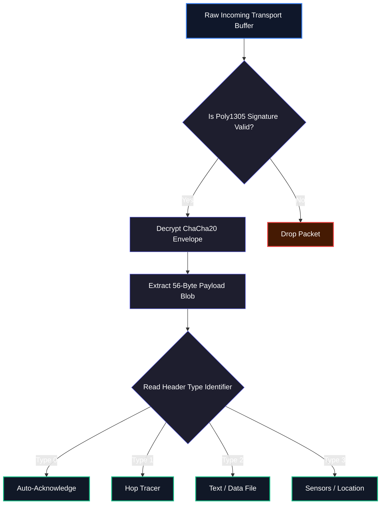

# 8. Payload Extensibility

Having physically encoded the packet via FSK, protected its state via interleaved Reed-Solomon(128,96), attached the 24-byte Routing/Addressing parameters via the Transport layer, and ultimately secured it against physical tampering across the mesh via the Split-MAC Nested Trust model...

...We finally land neatly down inside the **56-Byte Application Payload** shell. 

## 8.1 The 56-Byte Envelope

The Hermes protocol treats these core 56 bytes as a completely agnostic, isolated envelope boundary. All contents inside are mathematically sealed using the Packet ID and Traffic Key discussed in the security documentation.

### 8.1.1 Capacity Math
To maximize message throughput on the narrow FSK1200 physical layer, Hermes differentiates between raw byte capacity and encoded character capacity.

| Standard | Unit Capacity | Single Packet (56B) | Max Session (16 Frags) |
|:---|:---:|:---:|:---|
| **Raw Binary** | 8 Bits | 56 Bytes | 896 Bytes |
| **GSM-7 Text** | 7 Bits | **64 Characters** | **1024 Characters** |
| **ASCII Text** | 8 Bits | 56 Characters | 896 Characters |

From the network perspective, any data can ride securely inside a `MESSAGE` type payload, so long as it fits inside 56 raw bytes (or connects cleanly across 16 sequential Fragments).

## 8.2 Standard Packet Enumerations

Hermes Link specifies standard operational templates for utilizing these 56 bytes efficiently. The Transport Header's `Type` integer mapping (0-15 max boundaries) explicitly outlines precisely how destination nodes should handle decoding of the internal byte arrays.

| Type Integer | Identifier | Use Case |
|---:|:---|:---|
| `0` | **ACK** | Auto-generated validations confirming Nonce and Physical transmission reception along with basic node/RSSI health parameters |
| `1` | **PING** | Pure Network level packet mapping out consecutive 6-Byte hop addresses to trace explicit Mesh routing tracks |
| `2` | **MESSAGE** | Agnostic payload block for handling Chat strings, Text Data, Files, Audio formats, or custom string data. (Default: GSM-7 text data) |
| `3` | **TELEMETRY** | Highly compressed blob mapping Battery life, Location metrics (GPS/Alt), System Uptime, and Environmental Sensors |
| `4` | **DISCOVERY** | Used locally (via the special `DD` Discovery subnet properties) to locate neighbors mapping their connection details for Mesh routing tables |
| `5` | **KEY_RATCHET**| Strictly isolated packet containing cryptographic hash markers commanding Network / Subnet levels to physically iterate sequence states (Key Rotation) | 
| `6 - 15`| **RESERVED** | Structurally reserved for future expansion of the Hermes Protocol core features. |
| `16 - 31`| **EXPERIMENTAL** | Left completely unconstrained mapping custom logic, closed-source integrations, vendor-specific hardware controls, or experimental application payload streams. |

When working with the interactive protocol visualizer, you can dissect precisely how each packet type structurally packs bitwise into the 56-byte window. 

The following sections natively map the layout requirements for `ACKs`, `Ping`, `Message Text`, and advanced `Telemetry` flags.

## 8.3 Interactive Packet Builder

To construct any standard Hermes packet, toggle Addressing, toggle Telemetry bits, set random Keys, and observe exactly how the 24-byte Header and 56-byte Application Payload are generated in real-time hexadecimal, please utilize the standalone tool:

👉 **[Launch Interactive Packet Builder Tool](/docs/tools/packet-builder)**
