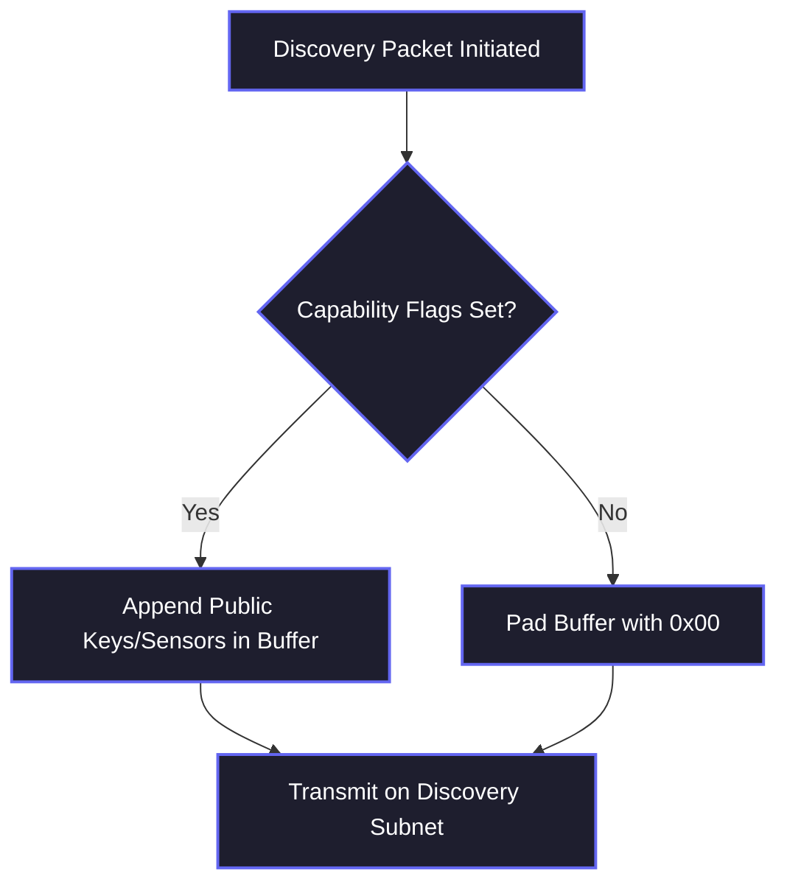

# 13. Type 4: Discovery

The **Type 4 Discovery** packet drives the autonomous mesh formation capabilities of Hermes Link. It operates as a continuous, low-bandwidth heartbeat radiating outward to instantly inform neighboring nodes of the sender's active presence, supported features, and routing characteristics.

Discovery packets are explicitly the only packet type that is legally permitted to broadcast indiscriminately on the `DD:DD:DD:DD:DD:DD` specialized discovery subnet without breaking default propagation rules.

## 13.1 Packet Structure

Because Discovery packets are meant to be fast and universally readable by any node running the Hermes firmware within physical RF range, they utilize the generic 54-byte envelope aggressively to pack identifying properties rather than payload text.

```mermaid
graph LR
    A["Node ID<br>(6 Bytes)"] --- B["Hardware Type<br>(1 Byte)"] --- C["Capabilities<br>(2 Bytes)"] --- D["Tx Power<br>(1 Byte)"] --- E["Available Buffer<br>(44 Bytes)"]
    classDef default fill:#1e1e2e,stroke:#89b4fa,stroke-width:2px,color:#ffffff;
    class E fill:#4c1d95,stroke:#a855f7,stroke-dasharray: 5 5,color:#ffffff;
```

### 13.1.1 Discovery Base Blob (10 Bytes)

The first 10 bytes immediately following the standard 26-byte header must contain the exact structured hardware definitions of the broadcasting node:

| Bit Offset | Length | Property | Description |
|---:|:---:|:---|:---|
| `0-5` | **6 Bytes** | **Origin Node ID** | Duplicate of the 6-byte source address in the transport header, utilized here to confirm no header manipulation occurred. |
| `6`   | **1 Byte**  | **Hardware Variant** | Describes the physical radio platform (e.g., `0x01` = Quansheng UV-K5, `0x02` = Beken BK4819 Generic, `0x03` = Desktop Relay). |
| `7-8` | **2 Bytes** | **Capability Bitmask** | A 16-bit flag array specifying support for advanced modules (e.g., GPS presence, Bluetooth Gateway, Battery Management, File Transfer). |
| `9` | **1 Byte** | **Base Tx Power** | The decibel (dBm) logarithmic value of the transmission, allowing receivers to aggressively calculate approximate physical distance utilizing path-loss modeling alongside their perceived RSSI lock. |

### 13.1.2 The Available Buffer (44 Bytes)

The remaining 44 bytes are strictly formatted up to the preference of the network administrator.



Common applications for this buffer include:
- Generating Ephemeral Public Keys for setting up 1-to-1 ratcheted Unicast sessions completely off-grid.
- Sending simplified text "Status" strings ("On Duty", "Moving", etc.).
- Informing neighboring stations of preferred Subnet channels to switch to away from the discovery frequency.

## 13.2 Connection Lifecycle

Nodes passively listening to the `DD:DD:DD:DD:DD:DD` subnet maintain a **Neighbor Table** tracking the health and existence of devices traversing their RF bubble.

1. **Insertion**: When a Discovery packet arrives from an unknown Node ID, the receiver mathematically proves its Poly1305 signature against the Master Key. If valid, the Node ID is appended to the Neighbor Table.
2. **Refresh**: If the Node ID already exists in the table, the local timeout (`TTL Expiry`) is aggressively reset, and the physical Link Quality variables (`RSSI`, `LQI`) are averaged against the new transmission.
3. **Eviction**: If no Discovery packets are received from a mapped node after 3 consecutive Discovery interval windows, the node is silently removed from the routing table and presumed offline or out of physical range.
