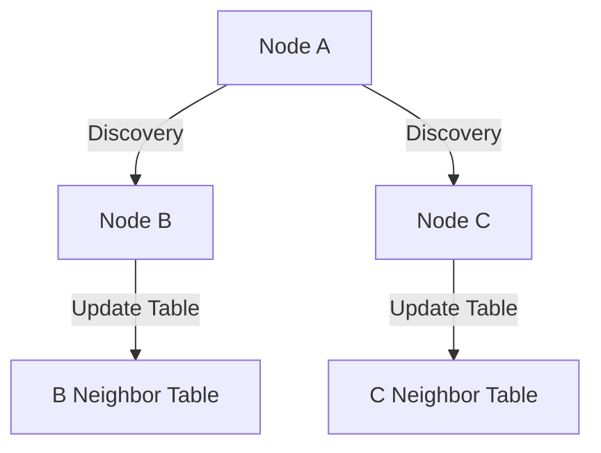

import { Radar, Search, UserPlus } from 'lucide-react';

# <Radar className="inline w-6 h-6 mr-2 text-rose-400" /> 4. Node Discovery

**Type 4 (DISCOVERY)** packets allow nodes to announce their presence and map out their immediate neighbors without prior configuration.

## 4.1 Discovery Subnet (`DD:DD:DD:DD:DD:DD`)

Discovery packets are sent to a reserved hardcoded destination. Unlike other packets, these are NEVER forwarded by routers—they are strictly **Single-Hop**.

## 4.2 Discovery Payload

| Field | Size | Description |
| :--- | :--- | :--- |
| **Callsign** | 6B | Alphanumeric CALL (e.g., N0CALL). |
| **Device Type** | 1B | Standard hardware family ID. |
| **Neighbor Count** | 1B | Number of nodes currently in the local table. |
| **Uptime** | 4B | Node uptime in seconds. |

## 4.3 Neighbor Mapping Workflow

1. **Beacon**: Every 10-30 minutes, a node sends a Discovery packet.
2. **Listen**: Local nodes hear the beacon and add the `Source` address and `SNR` to their neighbor table.
3. **RSSI Ranking**: Nodes prioritize neighbors with higher SNR for future routing decisions.

## 4.4 Passive vs Active Discovery

- **Passive**: Nodes silently listen for regular traffic and populate their tables based on any valid packet header.
- **Active**: Nodes explicitly poll the network by sending a Discovery packet and waiting for responses (usually limited to high-priority initial setup).

> [!TIP]
> **Neighbor Pruning**
> Implementation should prune neighbors from the table if no traffic has been heard from them for more than **2 discovery intervals** (e.g., 60 minutes).
