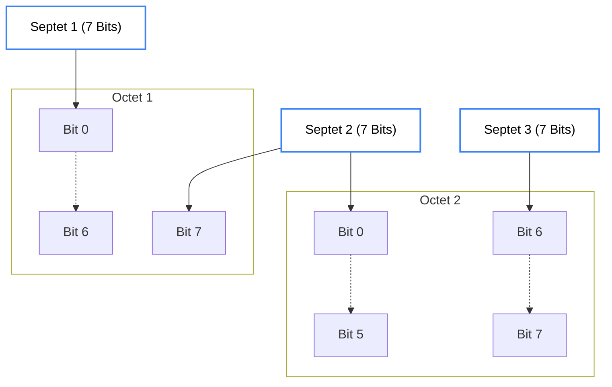

import { MessageSquare, Type, Zap } from 'lucide-react';
import Gsm7VisualizerMDX from '@/components/visualizer/Gsm7VisualizerMDX';

# <MessageSquare className="inline w-6 h-6 mr-2 text-indigo-400" /> 4. Type 2: Messaging

The **Type 2 (MESSAGE)** packet is the primary carrier for text communication. It maximizes the 56-byte window to provide high-capacity chat over low-bandwidth RF.

## 2.1 GSM-7 Encoding

Hermes maximizes its 56-byte payload by using the **GSM-7** specification. This allows common characters to be stored in **7 bits** instead of 8, effectively providing a **14.29%** increase in character capacity (64 characters total).

<Gsm7VisualizerMDX />

### 2.1.1 Bitwise Packing (Sliding Window)

Septets are packed into 8-bit octets using a **bit-packed, sliding-window scheme**. Unused bits from one byte are carried over to store the start of the next character.

- **1st Septet**: Bytes 0 (bits 0–6). Bit 7 is spare for the next septet.
- **2nd Septet**: Starts at Bit 7 of Byte 0, continues into Bits 0–5 of Byte 1.
- **3rd Septet**: Starts at Bit 6 of Byte 1, continues into Bits 0–4 of Byte 2.

This repeats such that every **(n * 7) bits** are packed into **ceil(n * 7 / 8)** bytes.

## 2.2 Standard Charset

| Hex | 0 | 1 | 2 | 3 | 4 | 5 | 6 | 7 | 8 | 9 | A | B | C | D | E | F |
| :--- | :--- | :--- | :--- | :--- | :--- | :--- | :--- | :--- | :--- | :--- | :--- | :--- | :--- | :--- | :--- | :--- |
| **0x0** | `@` | `£` | `$` | `¥` | `è` | `é` | `ù` | `ì` | `ò` | `Ç` | **LF** | `Ø` | `ø` | **CR** | `Å` | `å` |
| **0x1** | `Δ` | `_` | `Φ` | `Γ` | `Λ` | `Ω` | `Π` | `Ψ` | `Σ` | `Θ` | `Ξ` | **ESC** | `Æ` | `æ` | `ß` | `É` |
| **0x2** | **SP** | `!` | `"` | `#` | `¤` | `%` | `&` | `'` | `(` | `)` | `*` | `+` | `,` | `-` | `.` | `/` |
| **0x3** | `0` | `1` | `2` | `3` | `4` | `5` | `6` | `7` | `8` | `9` | `:` | `;` | `<` | `=` | `>` | `?` |
| **0x4** | `¡` | `A` | `B` | `C` | `D` | `E` | `F` | `G` | `H` | `I` | `J` | `K` | `L` | `M` | `N` | `O` |
| **0x5** | `P` | `Q` | `R` | `S` | `T` | `U` | `V` | `W` | `X` | `Y` | `Z` | `Ä` | `Ö` | `Ñ` | `Ü` | `§` |
| **0x6** | `¿` | `a` | `b` | `c` | `d` | `e` | `f` | `g` | `h` | `i` | `j` | `k` | `l` | `m` | `n` | `o` |
| **0x7** | `p` | `q` | `r` | `s` | `t` | `u` | `v` | `w` | `x` | `y` | `z` | `ä` | `ö` | `ñ` | `ü` | `à` |

## 2.3 Extended Charset (Escape 0x1B)

The **ESC** `0x1B` symbol can be used to precede a character from the extended table.

| Hex | 0 | 1 | 2 | 3 | 4 | 5 | 6 | 7 | 8 | 9 | A | B | C | D | E | F |
| :--- | :--- | :--- | :--- | :--- | :--- | :--- | :--- | :--- | :--- | :--- | :--- | :--- | :--- | :--- | :--- | :--- |
| **0x0** | ***bold*** | _ital_ | ~~strk~~ | <u>und</u> | | | | | | | **FF** | | | | | |
| **0x1** | | | | | `^` | | | | | | | **SS2** | | | | |
| **0x2** | | | | | | | | | `{` | `}` | | | `[` | | | `\` |
| **0x3** | `¶` | `™` | `®` | `©` | | | | | `«` | `»` | | | | `~` | `]` | |
| **0x4** | `│` | `←` | `→` | `↑` | `↓` | | `◀` | `▶` | | | | | | | | |
| **0x5** | `░` | `▒` | `█` | `▄` | `▌` | `▐` | `─` | `┌` | `┐` | `└` | `┘` | `├` | `┤` | `┬` | `┴` | `┼` |
| **0x6** | `■` | `□` | `●` | `○` | `▲` | `△` | `▼` | `▽` | `◆` | `◇` | `★` | `☆` | `☺` | `☻` | `♥` | `🌡` |
| **0x7** | `✓` | `✗` | `✉` | | | `€` | | | | | | | | | | |

## 2.4 Multi-Packet Messages

When a user sends a message longer than 64 characters (GSM-7), the application layer utilizes **Transport Fragmentation** (Network §3).

- **Reassembly Buffer**: 1024 Septets.
- **Fragment Count**: Up to 16 packets.

> [!TIP]
> **Hermes Formatting Tags**
> Extended codes `0x00`-`0x03` are used as toggle switches for formatting. A node receiving `[ESC][0x00]` should start rendering text as **bold** until a second `[ESC][0x00]` or the end of the message.
