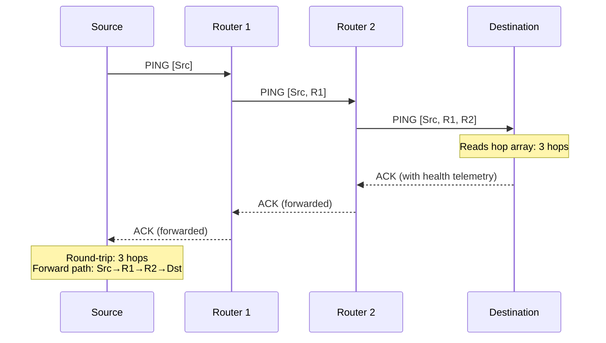

import { Locate, Route, Zap, Network } from 'lucide-react';

# <Locate className="inline w-6 h-6 mr-2 text-blue-400" /> 10. Type 1: Ping

The `Type 1 Ping` payload exists natively inside Hermes to trace valid RF hops out to adjacent nodes.

Unlike typical IP networks that leverage ICMP Ping natively just as an echo, a Hermes Ping actively documents its path logically up the mesh.

---

## 10.1 The Hop Array

The 56-byte payload operates efficiently as a contiguous array block. The payload carries up to **9 Sequential Hops** tracing the routing line, with the final 2 bytes reserved.


As the physical packet hops to limit the `TTL` Transport block, each consecutive Hermes relay node checks the Ping mapping.

It locates the first empty `0x00...` array slot inside the payload and automatically appends its unique 6-byte identifier (or Subnet Key Hash).

| Position | Hex Offset | Description |
|:---:|:---|:---|
| **Hop 1** | `0 - 5` | Originator (or 1st Intermediate Repeater) Node Address |
| **Hop 2** | `6 - 11` | 2nd Repeater Node Address |
| **Hop 3** | `12 - 17` | 3rd Repeater Node Address |
| **Hop 4** | `18 - 23` | 4th Repeater Node Address |
| **Hop 5** | `24 - 29` | 5th Repeater Node Address |
| **Hop 6** | `30 - 35` | 6th Repeater Node Address |
| **Hop 7** | `36 - 41` | 7th Repeater Node Address |
| **Hop 8** | `42 - 47` | 8th Repeater Node Address |
| **Hop 9** | `48 - 53` | 9th Repeater Node Address |
| **Reserved** | `54 - 55` | 2 Bytes reserved for future Transit/SNR metrics |

---

## 10.2 Hop Processing Logic

When a router forwards a PING packet:

1. It scans the payload for the first block of six `0x00` bytes.
2. It inserts its own **6-byte Node Address** into that slot.
3. It regenerates the Outer MAC and forwards the packet.

```c
void Hermes_ProcessPingRelay(uint8_t* payload) {
    // Find first empty 6-byte slot
    for (int i = 0; i < 9; i++) {
        uint8_t* slot = &payload[i * 6];
        bool empty = true;
        for (int j = 0; j < 6; j++) {
            if (slot[j] != 0x00) { empty = false; break; }
        }
        if (empty) {
            memcpy(slot, my_node_address, 6);
            return;
        }
    }
    // All 9 slots full — do not modify payload
}
```

---

## 10.3 Ping ACKs

Because `PING` payloads inherently specify `Want Ack = 1` inside their formulation headers, tracing Ping responses implicitly returns a `Type 0 ACK` carrying the network's specific telemetry metrics.

Between reviewing the `Type 0` Return Telemetry metrics (LQI, Distance, SNR) and analyzing the `PING` response routing headers visually on the return journey, Hermes operators maintain explicit topography maps characterizing local line-of-sight signal degradation in an active mesh grid context.



---

## 10.4 Traceroute Capability

By analyzing the returned `Type 0 ACK` (which confirms the Ping) and the Hop Array within the Ping itself, the originator can reconstruct the exact chain of nodes that delivered the message.

> [!TIP]
> **Diagnostic Use:** Pings are invaluable for identifying "bottleneck" nodes that are handling a disproportionate amount of mesh traffic, or for finding "dead zones" where packets fail to propagate.

> [!NOTE]
> **Maximum Mesh Diameter:** With 9 hop slots and a TTL of 15, the practical mesh diameter is limited by the hop array. Packets that exceed 9 relays will still be delivered but the PING trace will be truncated at the 9th router.
