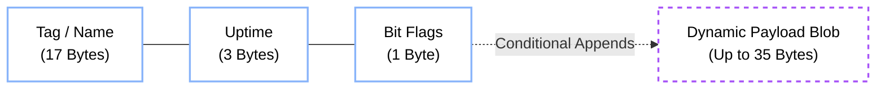
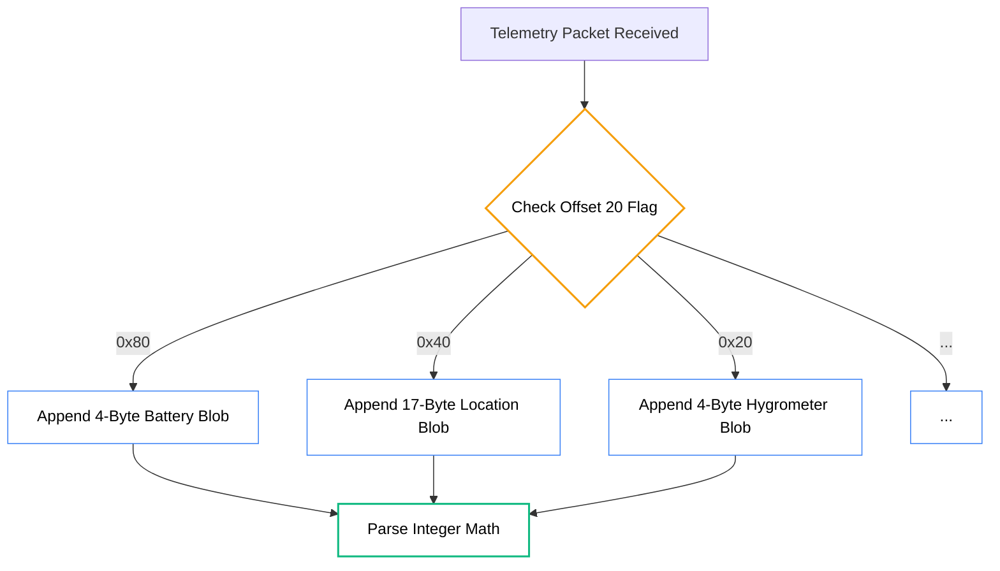

import { Activity, MapPin, Battery, Thermometer, Droplets, Wind, Sun, Move } from 'lucide-react';
import TelemetryVisualizerMDX from '@/components/visualizer/TelemetryVisualizerMDX';

# <Activity className="inline w-6 h-6 mr-2 text-emerald-400" /> 5. Type 3: Telemetry

While `Type 1 Ping` explicitly analyzes topological routing hops, the **Type 3 Telemetry** packet defines a highly dense structure reporting exact environmental conditions, positional movement data, and hardware sensors of remote nodes.

This packet efficiently packs values that, if formatted via JSON or XML ASCII, would violently overflow the 56-byte capacity constraints.

---

## 12.1 The Telemetry Base Array

Every Telemetry packet utilizes the same 21-byte header foundation:

| Offset | Format | Description |
|---:|:---|:---|
| `0 - 16` | **17 Byte GSM-7** | **Tag**: Human Readable Device Name string (e.g., `APEX-Relay-East`) |
| `17 - 19` | **3 Byte Integer** | **Uptime**: Total Node system ticks (`0.25s` per tick), representing 11+ Days array limit. |
| `20` | **1 Byte Flag** | **Flags**: Dictates the conditional presence of additional trailing data blobs inside the 35-byte remaining footprint. |

---

## 12.2 Conditional Bit Flags (Offset 20)

Offset byte 20 directly toggles the existence of proceeding metric blocks.

| Bit (`&`) | Toggle Description | Appended Payload Bytes if True (+35 Cap) |
|:---:|:---|:---|
| `0x80` (`7`) | **Has Battery Info** | `+4 Bytes` (Voltage/Current integer representation) |
| `0x40` (`6`) | **Has Location Blob** | `+17 Bytes` (High Density compression format) |
| `0x20` (`5`) | **Has Hygrometer** | `+4 Bytes` (Humidity % and Temp Celsius × 100) |
| `0x10` (`4`) | **Has Gas Sensor** | `+4 Bytes` (Gas PPM limits and Pressure hPa markers) |
| `0x08` (`3`) | **Has Lux Sensor** | `+2 Bytes` (Light density array tracking) |
| `0x04` (`2`) | **Has UV Range** | `+2 Bytes` (UV index ratings × 100 integer array) |
| `0x02` (`1`) | **Has Movement** | `+2 Bytes` (Magnitude tracking output) |
| `0x01` (`0`) | **IS CUSTOM STRING** | Represents trailing remainder format is custom generic data byte string array bypassing standard constraints. |

> [!IMPORTANT]
> **Crucial Flow:** The byte blobs conditionally append exactly in order of the bit flag definitions. For example, if both `0x80` (Battery) and `0x40` (Location) are marked `1`, then bytes `21-24` inherently represent the `Battery Voltage/Current`, while bytes `25-41` immediately trail mapping out the `Location` string arrays.

---

## 12.3 High Density Location Mapping

To effectively map all properties of an active positioning object natively back into the RF stream without violating the 17-byte blob limitation, Hermes bitwise concatenates coordinates and matrices heavily across a massive chained array integer.

It shifts values across a mapped range scale, casting floating decimals directly back into solid integers fitting physical bit buckets.

| Metric | Bit Length | Allowed Range | Transformation Formula |
|:---|:---:|:---|:---|
| **Latitude** | `24 Bits` | ±90 degrees | `(Lat + 90) × (16777215 / 180)` |
| **Longitude** | `24 Bits` | ±180 degrees | `(Lon + 180) × (16777215 / 360)` |
| **Altitude** | `20 Bits` | -1000m to +30,000m | `(Alt + 1000) × 10` |
| **GPS Week** | `10 Bits` | 0 to 1023 | Direct mapping |
| **Time of Week** | `20 Bits` | 0 to 604,799 s | Direct mapping |
| **Speed** | `12 Bits` | 0.00 to 40.95 m/s | `Speed × 100` |
| **Heading** | `12 Bits` | 0.0 to 359.9° | `Heading × 10` |
| **Satellites** | `6 Bits` | 0 to 63 | Direct mapping |
| **Precision** | `8 Bits` | 0.0m to 25.5m | `HDOP × 10` |

A standard DataView can readily parse these fields directly out of the bit representation arrays via bitwise shifts, guaranteeing efficient bandwidth rendering even against highly turbulent moving network objects mapping location topographies in real time.

---

## 12.4 Transmission Intervals

To prevent channel saturation, telemetry packets follow an exponential backoff or high-delay interval:
- **Stationary**: 15 minutes.
- **In Motion**: 1 minute (or based on distance traveled).

> [!IMPORTANT]
> **Privacy Note:** Location telemetry is only decrypted by nodes possessing the **Scope Secret** for the broadcast/group. Passive listeners with only the $K_{mesh}$ will see that a Telemetry packet was sent but cannot decode the GPS coordinates.

---

## 12.5 Interactive Telemetry Analysis

The visualizer below explicitly breaks down a maximum-density Telemetry packet containing every possible 56-byte metric. Notice how the bit fields map densely against the byte limits.

<TelemetryVisualizerMDX />
