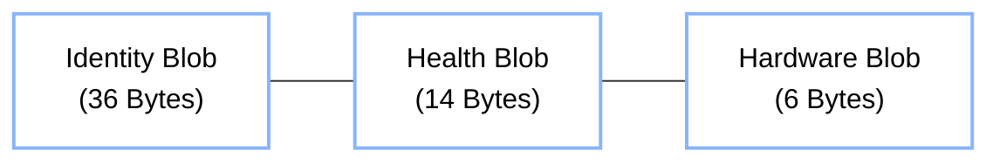
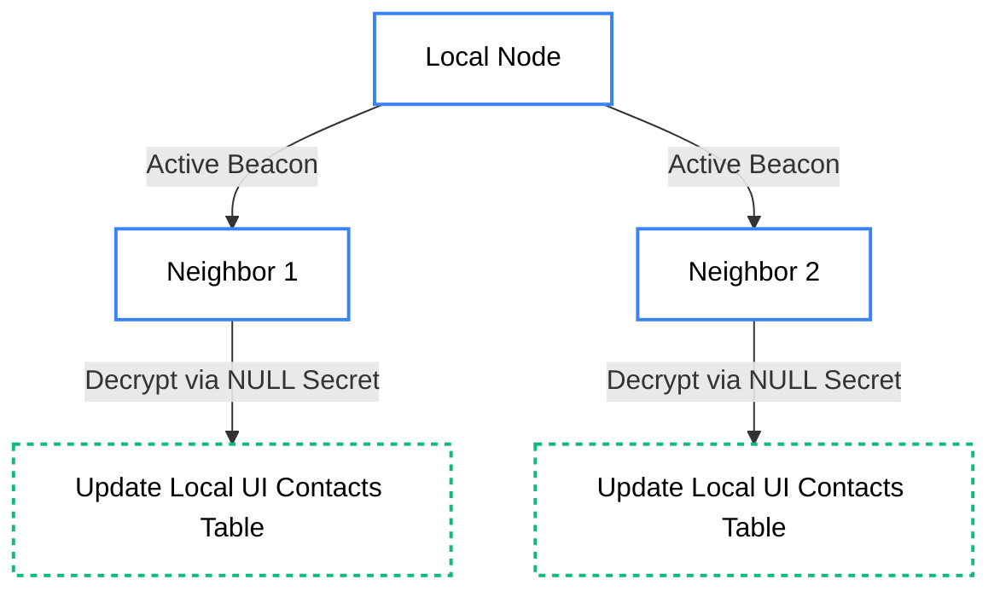

import { Radar, Search, UserPlus } from 'lucide-react';

# <Radar className="inline w-6 h-6 mr-2 text-rose-400" /> 6. Type 4: Discovery

**Type 4 (DISCOVERY)** packets allow nodes to announce their presence, human-readable identity, and hardware health to the local mesh. 

Unlike traditional routing protocols, Hermes does **not** rely on these packets to build its core distance-vector routing tables (which are maintained passively via any overheard traffic). Instead, Discovery packets serve as "Contact Cards" that surface useful metadata to the user interface.

## 4.1 Discovery Subnet (`DD:DD:DD:DD:DD:DD`)

Discovery packets are sent to a reserved hardcoded destination. Unlike other packets, these are NEVER forwarded by routers—they are strictly **Single-Hop**.

## 4.2 The 56-Byte Payload

The Discovery payload perfectly maps to the 56-byte application envelope, packing human identity alongside dense telemetry.

### 1. Human Readable Identity (36 Bytes)

| Byte Range | Size | Field | Description |
|:---:|:---:|:---|:---|
| `0 - 11` | 12B | **Alias** | GSM-7 Encoded Username/Callsign (up to 13 chars). |
| `12 - 35` | 24B | **Presence Status** | GSM-7 Encoded Bio/Status message (up to 27 chars). |

### 2. Mesh Topology & Health (14 Bytes)

| Byte Range | Size | Field | Description |
|:---:|:---:|:---|:---|
| `36` | 1B | **Neighbor Count** | Total number of nodes currently held in the sender's local table. |
| `37 - 39` | 3B | **Uptime** | Node uptime represented in ticks (0.25s per tick), packed little-endian. |
| `40` | 1B | **TX Power** | The configured transmit power setting in dBm. |
| `41` | 1B | **Battery Metric** | **Bit 7**: Has Battery. **Bits 0-6**: Voltage in 0.1V steps. |
| `42` | 1B | **Idle RSSI** | The receiver's active noise floor immediately prior to transmission (e.g., -105 dBm). |
| `43` | 1B | **Highest LQI** | The `0-255` Link Quality Indicator score of the node's best connection. |
| `44 - 49` | 6B | **Best Neighbor** | The 6-byte Destination ID of that strongest link. |

### 3. Hardware & Capabilities (6 Bytes)

| Byte Range | Size | Field | Description |
|:---:|:---:|:---|:---|
| `50` | 1B | **Node Role** | E.g., `0`=Client, `1`=Router, `4`=Tracker, `6`=Gateway. |
| `51` | 1B | **Capabilities** | Bitmask defining hardware features (e.g., Has Screen, Has GPS). |
| `52 - 55` | 4B | **Traffic Counter** | The total number of packets successfully forwarded by this node. |

## 4.3 Presence Workflow

1. **Beacon**: Every 10-30 minutes, a node broadcasts a Discovery packet to the `DD:DD...` subnet.
2. **Decode**: Local neighbors receive the packet. Because the public `NULL` secret is used for the Traffic Key, any node with the $K_{mesh}$ can decrypt the payload and read the alias and status.
3. **UI Update**: The receiving node updates its UI "Contacts" or "Nearby Nodes" list with the human-readable data and battery metrics.

## 4.4 Passive vs Active Discovery

- **Passive Routing (Core)**: Nodes silently listen for *any* valid traffic (Pings, Messages, ACKs) and populate their internal routing tables based on the Transport Header's `Source` address and incoming SNR.
- **Active Discovery (UI)**: Nodes broadcast these dense Type 4 packets specifically to share names and statuses with human operators or high-level network mappers.

> [!TIP]
> **Privacy Consideration**
> If a node is operating in "Stealth Mode," it may completely disable Type 4 Discovery broadcasts while continuing to silently route mesh traffic and maintain its passive tables.
