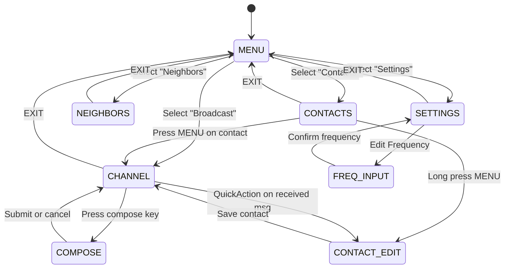
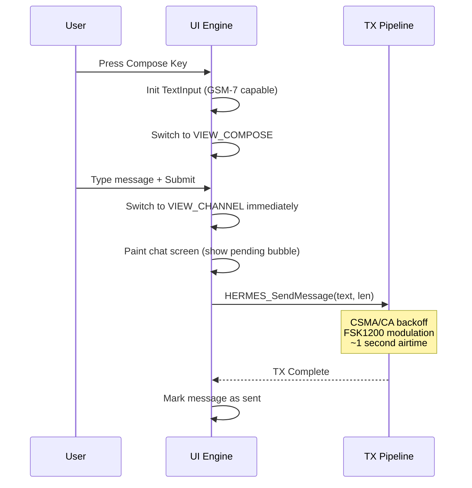

import { Smartphone, MessageSquare, Users, Radio, Settings, Eye, Send, Shield, Zap, Activity, Bell } from 'lucide-react';

# <Smartphone className="inline w-6 h-6 mr-2 text-sky-400" /> 8. Device User Experience

The Hermes application layer drives a complete **on-device messenger UX** designed for resource-constrained embedded displays (128×64 monochrome LCD). This section documents the full view architecture, rendering algorithms, and interaction patterns that make up the device experience.

> [!IMPORTANT]
> All pseudocode in this section is derived from the reference C implementation and is intended as a specification guide. Implementers should adapt the patterns to their target platform's display driver and input system.

---

## 15.1 View State Machine

The UI operates as a **finite state machine** with 11 distinct views. Navigation between views is driven by physical key events (directional pad, MENU, EXIT, PTT).

### 15.1.1 View Definitions

| View | Purpose | Entry Trigger |
|:---|:---|:---|
| **MENU** | Root navigation hub | App launch / EXIT from child |
| **CHANNEL** | Chat bubble view (broadcast or DM) | Select "Broadcast" or a contact |
| **COMPOSE** | Full text input keyboard | Press compose key from CHANNEL |
| **CONTACTS** | Scrollable contact list with badges | Select "Contacts" from MENU |
| **GROUPS** | Multicast group list | Select "Groups" from MENU |
| **NEIGHBORS** | Live neighbor discovery table | Select "Neighbors" from MENU |
| **SETTINGS** | Hierarchical configuration menu | Select "Settings" from MENU |
| **INFO** | Single node detail card | Long-press on a neighbor |
| **CONTACT_EDIT** | Quick contact editor (alias/secret) | Long-press a contact or QuickAction |
| **FREQ_INPUT** | Numeric frequency entry | Select "Frequency" in Settings |
| **DEBUG** | Raw protocol counters overlay | Toggle from Settings |

### 15.1.2 Navigation Graph



### 15.1.3 Status Title Synchronization

Every view transition **MUST** update the status bar title to reflect the current context. This prevents user confusion during rapid navigation:

```c
void UpdateStatusTitle(void) {
    switch (currentView) {
        case VIEW_CHANNEL:
            if (selectedContact < 0) SetTitle("!broadcast");
            else                     SetTitle("Chat");
            break;
        case VIEW_COMPOSE:    SetTitle("Compose");     break;
        case VIEW_NEIGHBORS:  SetTitle("Neighbors");   break;
        case VIEW_SETTINGS:   SetTitle("Settings");    break;
        case VIEW_CONTACT_EDIT: SetTitle("Contact Edit"); break;
        case VIEW_MENU:
        default:              SetTitle(NULL);           break;
    }
}
```

---

## 15.2 Chat Rendering Engine

The CHANNEL view implements a **bottom-anchored, scrollable chat bubble renderer** that emulates modern messaging apps within a 128×64 pixel monochrome framebuffer.

### 15.2.1 Layout Architecture

```
┌─────────────────────────────────┐ ← Status Bar (8px)
│ !broadcast                      │
├─────────────────────────────────┤
│  ┌──────────────┐               │ ← Incoming bubble (left-aligned)
│  │ Hello mesh!  │               │
│  └──────────────┘               │
│                 ┌──────────────┐│ ← Outgoing bubble (right-aligned)
│                 │ Hi back!   ✓ ││    with ACK tick
│                 └──────────────┘│
│  @1a2b                          │ ← Sender label (only on first msg)
│  ┌──────────────────────────┐   │ ← Multi-line incoming
│  │ This is a longer message │   │
│  │ that wraps onto two lines│   │
│  └──────────────────────────┘   │
│  · (unread dot)              ▐  │ ← Scrollbar thumb
├─────────────────────────────────┤
│ [M]QuickAct [↑↓]Scroll [EXIT]  │ ← Help bar (8px)
└─────────────────────────────────┘
```

### 15.2.2 Font Selection

Message text length determines font size to maximize readability:

```c
bool IsTinyFont(const Message_t *m) {
    return (strlen(m->text) > 22);  // Switch to 4px font for longer text
}

// Tiny: 4px wide chars, 6px line height, 26 chars/line
// Medium: 8px wide chars, 12px line height, 14 chars/line
```

### 15.2.3 Word-Wrap Algorithm

Text is wrapped using a greedy line-breaking algorithm with word-boundary awareness:

```c
void GetLineInfo(const char *text, uint16_t text_len,
                 uint8_t max_chars, uint8_t line_idx,
                 uint16_t *start, uint16_t *len) {
    uint16_t pos = 0;
    uint8_t  curr_line = 0;

    while (pos < text_len) {
        uint16_t line_start = pos;
        uint16_t line_len = 0;
        uint16_t last_space = NONE;

        // Consume characters up to max_chars
        while (pos < text_len && line_len < max_chars) {
            if (text[pos] == ' ') last_space = pos;
            pos++; line_len++;
        }

        // If mid-word at line end, backtrack to last space
        if (pos < text_len && text[pos] != ' '
            && last_space != NONE && last_space >= line_start) {
            pos = last_space + 1;
            line_len = pos - line_start;
        }

        if (curr_line == line_idx) {
            *start = line_start;
            // Trim trailing spaces
            while (line_len > 0 && text[line_start + line_len - 1] == ' ')
                line_len--;
            *len = line_len;
            return;
        }

        // Skip inter-line whitespace
        while (pos < text_len && text[pos] == ' ') pos++;
        curr_line++;
    }
    *start = 0; *len = 0;
}
```

### 15.2.4 Bubble Dimension Calculation

Each message bubble's width and height are calculated dynamically:

```c
uint8_t GetBubbleWidth(const Message_t *m) {
    bool tiny = IsTinyFont(m);
    uint8_t max_chars = tiny ? 26 : 14;
    uint8_t lines = GetLineCount(m);
    uint8_t bw = MAX_BUBBLE_WIDTH;   // 112px

    if (lines == 1) {
        uint16_t s, l;
        GetLineInfo(m->text, m->len, max_chars, 0, &s, &l);
        bw = l * (tiny ? 4 : 8) + 8;  // char_width × count + padding
    }
    return MIN(bw, MAX_BUBBLE_WIDTH);
}

uint8_t GetBubbleHeight(int16_t idx) {
    bool tiny = IsTinyFont(&messages[idx]);
    uint8_t lines = GetLineCount(&messages[idx]);
    uint8_t bh = tiny ? (lines * 6 + 3) : (lines * 12 - 1);

    // Add sender label space for first message in a group
    if (!messages[idx].is_outgoing && !IsSameSender(idx, idx - 1))
        bh += 8;

    // Add inter-group spacing
    if (!IsSameSender(idx, idx + 1)) bh += 2;
    else bh -= 1;  // Merge consecutive bubbles

    return MAX(bh, 1);
}
```

### 15.2.5 Visual Indicators

| Element | Rendering | Condition |
|:---|:---|:---|
| **Unread Dot** | 2×2 filled square at left edge | `!is_read && !is_outgoing` |
| **ACK Tick ✓** | 5×4 pixel bitmap checkmark | `is_outgoing && is_acked` |
| **Pending Outline** | Hollow bubble (no fill) | `is_outgoing && is_pending` |
| **Selected Highlight** | Inverted fill (white text on black) | Current scroll position |
| **Sender Label** | Tiny font above bubble | First msg in incoming group |
| **Scrollbar** | 1px vertical track + 3×3 thumb | Always visible when messages exist |

---

## 15.3 Contact Manager

### 15.3.1 Cache Architecture

Contacts are managed via an **8-slot LRU cache** that blends persistent storage with runtime auto-discovery:

```c
#define CONTACT_CACHE_SIZE 8

void LoadContacts(void) {
    contactCount = 0;

    // Phase 1: Load saved contacts from non-volatile storage
    for (uint8_t i = 0; i < 32 && contactCount < CACHE_SIZE; i++) {
        Contact_t c;
        if (Storage_Read(CONTACTS_RECORD, i, &c)) {
            if (c.node_id[0] != 0xFF && c.node_id[0] != 0x00)
                contacts[contactCount++] = c;
        }
    }

    // Phase 2: Append unsaved recent senders from message history
    for (uint8_t i = 0; i < messageCount && contactCount < CACHE_SIZE; i++) {
        if (messages[i].is_outgoing) continue;
        if (messages[i].addressing == ADDR_BROADCAST) continue;

        bool found = false;
        for (uint8_t j = 0; j < contactCount; j++) {
            if (memcmp(contacts[j].node_id, messages[i].src, 6) == 0) {
                found = true; break;
            }
        }

        if (!found) {
            // Create temporary contact from last 2 bytes of Node ID
            Contact_t tmp = {0};
            memcpy(tmp.node_id, messages[i].src, 6);
            HexEncode(tmp.alias, messages[i].src + 4, 2);  // e.g. "1a2b"
            contacts[contactCount++] = tmp;
        }
    }
}
```

### 15.3.2 Unread Badge Counter

Each contact and menu item displays a pixel-perfect unread badge:

```c
uint8_t GetUnreadCount(AddressingMode addr, const uint8_t *node_id) {
    uint8_t count = 0;
    for (uint8_t i = 0; i < messageCount; i++) {
        if (messages[i].is_read || messages[i].is_outgoing) continue;
        if (messages[i].addressing != addr) continue;

        if (addr == ADDR_BROADCAST)      count++;
        else if (addr == ADDR_MULTICAST) {
            if (!node_id || memcmp(messages[i].dest, node_id, 6) == 0) count++;
        }
        else if (addr == ADDR_UNICAST) {
            if (!node_id || memcmp(messages[i].src, node_id, 6) == 0) count++;
        }
    }
    return count;
}
```

### 15.3.3 Contact List Item Rendering

Each contact row displays alias, node ID, health indicators, and unread badges:

```
┌────────────────────────────────┐
│ Alice                    🔋 ▂▄▆│ ← Alias + Battery + Antenna bars
│ @1a2b                      [3]│ ← Short ID + Unread count badge
├────────────────────────────────┤
│ Bob                      🔋 ▂▄ │
│ #group1                       │ ← Multicast prefix '#'
└────────────────────────────────┘
```

---

## 15.4 Neighbor Discovery Panel

### 15.4.1 Neighbor Table

The device maintains a **16-slot neighbor table** populated by periodic Discovery beacons (Type 4 packets):

```c
#define NEIGHBOR_TABLE_SIZE 16
#define NEIGHBOR_EVICT_MISSED 3  // Evict after 3 missed beacons

typedef struct {
    uint8_t  node_id[6];
    uint8_t  hw_variant;       // 0x01=UV-K5, 0x02=BK4819, 0x03=Desktop
    uint16_t capabilities;     // Hardware capability bitmask
    uint8_t  tx_power;         // dBm
    int8_t   rssi;             // Last observed signal strength
    uint8_t  battery;          // Bit7=has_battery, Bit[6:0]=0.1V steps
    uint8_t  lqi;              // Fast Sigmoid LQI (0-255)
    uint8_t  missed_count;     // Consecutive missed beacons
    uint32_t last_seen;        // System tick timestamp
    bool     active;
} Neighbor_t;
```

### 15.4.2 Eviction Policy

```c
void Neighbor_Tick(void) {
    for (uint8_t i = 0; i < TABLE_SIZE; i++) {
        if (!table[i].active) continue;
        if (Now() - table[i].last_seen > DISCOVERY_INTERVAL) {
            table[i].missed_count++;
            if (table[i].missed_count >= EVICT_MISSED)
                table[i].active = false;  // Evict stale neighbor
        }
    }
}
```

### 15.4.3 Micro-Icon Rendering

Neighbors display **battery** and **antenna strength** micro-icons (pixel art):

```c
// Battery micro-icon (7×4 pixels)
// ┌──────┐┐
// │ ████ ││  ← Fill proportional to voltage
// └──────┘┘
// Voltage range: 7.0V (0%) → 8.4V (100%)

void DrawBattery(uint8_t x, uint8_t y, uint8_t raw) {
    if (!(raw & 0x80)) return;       // Bit7 = has battery
    uint8_t voltage = raw & 0x7F;    // 0.1V steps
    int8_t percent = (voltage - 70) * 100 / 14;
    percent = CLAMP(percent, 0, 100);
    uint8_t fill = (percent * 4) / 100;
    DrawRect(x, y, 6, 4);            // Outline
    DrawVLine(x + 6, y + 1, 2);      // Terminal tip
    FillRect(x + 1, y + 1, fill, 2); // Charge level
}

// Antenna + signal bars (variable width)
// │   ▂ ▄ ▆     ← 0-3 bars based on LQI thresholds
// ┴
void DrawAntenna(uint8_t x, uint8_t y, uint8_t lqi) {
    DrawVLine(x + 1, y, 5);          // Antenna mast
    DrawHLine(x, y, 3);              // Antenna cap
    uint8_t bars = (lqi > 200) ? 3 : (lqi > 100) ? 2 : (lqi > 20) ? 1 : 0;
    for (uint8_t i = 0; i < bars; i++)
        DrawVLine(x + 4 + (i * 2), y + 4 - (i * 2), i + 1);
}
```

---

## 15.5 Settings Architecture

### 15.5.1 Data-Driven Menu System

Settings are implemented using a **declarative `MenuItem` struct** pattern. Each item carries function pointers for value retrieval and mutation, enabling a generic rendering engine:

```c
typedef struct MenuItem {
    const char *name;
    void (*get_value_text)(const MenuItem*, char*, uint8_t);
    void (*change_value)(const MenuItem*, bool up);
    bool (*action)(const MenuItem*, Key_t, bool pressed, bool held);
    Menu *submenu;
    uint8_t type;       // M_ITEM_SELECT, M_ITEM_ACTION, etc.
    uint8_t setting;    // Opaque context byte
} MenuItem;
```

### 15.5.2 Menu Hierarchy

```
Hermes (Root)
├── Broadcast    → Opens broadcast CHANNEL
├── Contacts     → Opens CONTACTS list
├── Neighbors    → Opens NEIGHBORS panel
└── Settings
    ├── Network
    │   ├── Freq Mode   [VFO / LPD66 / MANUAL / CH-xxx]
    │   ├── Frequency   [433.XXX.XXX MHz]
    │   ├── Modulation  [F700 / F450 / A1200]
    │   ├── Sync Word   [2F2A11DB / 555555AA / ...]
    │   ├── Mesh Fwd    [ON / OFF]
    │   ├── Auto ACK    [ON / OFF]
    │   └── Net Key     [SET / NULL]
    └── Node
        ├── Hermes      [ON / OFF]
        ├── Power       [LOW / MID / HIGH]
        ├── Alias       [editable text]
        ├── Audio       [HEAR / MUTE]
        ├── My ID       [HARDWARE / custom hex]
        ├── Neighbors   [count]
        ├── Messages    [count]
        ├── Contacts    [count]
        ├── TTL         [1-7]
        └── Debug       [ON / OFF]
```

### 15.5.3 Configuration Persistence

All settings are serialized to non-volatile storage via a single `HermesConfig_t` record:

```c
// Written on every change via SaveConfig()
Storage_Write(REC_HERMES_CONFIG, &config, 0, sizeof(HermesConfig_t));
```

---

## 15.6 Compose & Transmit Flow

### 15.6.1 Text Input Lifecycle



> [!TIP]
> **Immediate Paint Pattern**: The UI switches to the CHANNEL view and renders the pending message bubble *before* initiating the RF transmission. This prevents the user from staring at a frozen compose screen during the ~1 second FSK1200 airtime. The outgoing bubble renders with a hollow outline to indicate "pending" status.

### 15.6.2 TX State Machine

Each outgoing message progresses through a dedicated transmission state machine:

| State | Value | Description |
|:---|:---:|:---|
| **IDLE** | 0 | Message stored, not yet queued |
| **WAIT_CSMA** | 1 | Performing Clear Channel Assessment |
| **WAIT_DIFS** | 2 | Distributed Inter-Frame Spacing delay |
| **PENDING_ACK** | 3 | Packet transmitted, awaiting ACK response |
| **FAILED** | 4 | Max retries exhausted, delivery failed |
| **DONE** | 5 | ACK received, delivery confirmed |

### 15.6.3 QuickAction

When viewing a received message in the CHANNEL view, pressing the MENU key triggers a **QuickAction**:

1. If the sender is already in the contact list → Navigate to their DM channel
2. If the sender is unknown → Open the CONTACT_EDIT view pre-filled with their Node ID

This enables rapid contact creation from incoming messages without navigating through menus.

---

## 15.7 Debug Overlay

When enabled, a transparent debug overlay renders protocol counters directly onto the framebuffer:

```
S:0042 F:038 D:012      ← FSK Sync/FIFO/RxDone counts
M:0 P:1 PN:45821        ← Modem result, Protocol result, PN seed
T:2 A:0 D:N U:Y         ← Type, Addressing, Duplicate, ForUs
```

> [!NOTE]
> The debug overlay is only rendered when the user is **not** in the CHANNEL view, to avoid obscuring chat content. It provides real-time visibility into the modem pipeline, helping developers diagnose synchronization, deduplication, and addressing issues in the field.
