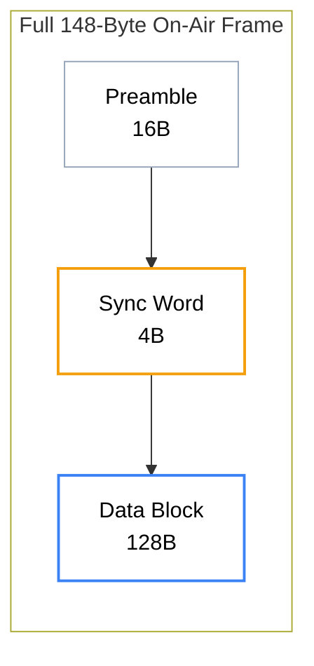

import PhysicalFrameVisualizerMDX from '@/components/visualizer/PhysicalFrameVisualizerMDX';
import { Layers, Box, Info } from 'lucide-react';

# <Layers className="inline w-6 h-6 mr-2 text-blue-400" /> 1. Physical Framing

The Hermes Link Data Link Layer (L2) encapsulates higher-layer packets into a fixed-length physical frame optimized for the 1.2kbps FSK pipe.

## 1.1 Frame Structure Overview

Every transmission consists of exactly **148 bytes** on the air:
- **16 Bytes**: Preamble
- **4 Bytes**: Sync Word
- **128 Bytes**: Data Block (FEC Encoded)



## 1.2 The 128-Byte Data Block

The data block is a single Reed-Solomon codeword. Internally, it is divided into the functional packet (96 bytes) and the parity overhead (32 bytes).

| Offset | Field | Size | Description |
| :--- | :--- | :--- | :--- |
| 0 - 23 | **Header** | 24 Bytes | Routing, TTL, and Nonce |
| 24 - 79 | **Payload** | 56 Bytes | User/Application data |
| 80 - 87 | **Inner MAC** | 8 Bytes | Inner Layer Integrity |
| 88 - 95 | **Outer MAC** | 8 Bytes | Outer Layer Integrity |
| 96 - 127 | **RS Parity** | 32 Bytes | Forward Error Correction |

## 1.3 Bit-Level Layout

<PhysicalFrameVisualizerMDX />

## 1.4 Hardware Interfacing (BK4819)

Implementing Hermes framing on the BK4819 requires direct interaction with the chip's internal FSK FIFO.

### 1.4.1 FIFO Management
- **TX FIFO**: Data is loaded into `REG_5F` in 16-bit words.
- **RX FIFO**: Data is read from `REG_5F` when the **Almost Full** threshold is reached or when the **RX Finished** interrupt occurs.
- **Clearance**: FIFOs must be cleared via `REG_59<15:14>` before every new transaction to prevent stale data contamination.

### 1.4.2 Interrupt Handling
Hardware implementations should monitor `REG_02` for the following bit-flags during passive reception:

| Bit | Identifier | Description |
| :--- | :--- | :--- |
| `0x0002` | **FSK_RX_SYNC** | Sync Word detected. Prepare for incoming data. |
| `0x0010` | **FSK_FIFO_ALMOST_FULL** | FIFO has reached threshold. Read chunk immediately. |
| `0x0001` | **FSK_RX_FINISHED** | End of packet reached. Finalize reassembly and FEC. |

### 1.4.3 RX Pseudocode (Interrupt Driven)
```c
/**
 * @brief Handles BK4819 FSK Interrupts.
 */
void BK4819_ISR(void) {
    uint16_t status = BK4819_ReadRegister(BK4819_REG_02);
    
    if (status & BK4819_REG_02_FSK_RX_SYNC) {
        // Reset local RX buffer index
        gRxIndex = 0;
    }
    
    if (status & BK4819_REG_02_FSK_FIFO_ALMOST_FULL) {
        // Read 16-bit words into buffer
        uint8_t count = BK4819_ReadRegister(BK4819_REG_5E) & 0x07;
        for(int i=0; i<count; i++) {
            uint16_t word = BK4819_ReadRegister(BK4819_REG_5F);
            gRxBuffer[gRxIndex++] = word & 0xFF;
            gRxBuffer[gRxIndex++] = word >> 8;
        }
    }
}
```

> [!IMPORTANT]
> **Fixed Length Requirement**
> Unlike many protocols that use variable lengths (e.g., AX.25), Hermes uses **Strictly Fixed Length Framing**. This eliminates the need for length headers (which are prone to corruption) and allows the FEC engine to always operate at peak mathematical efficiency on a known block size.
