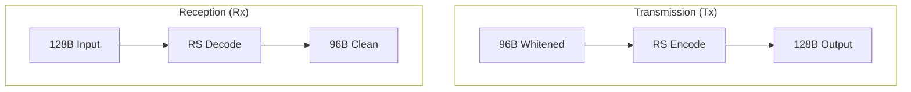

import FecBurstVisualizerMDX from '@/components/visualizer/FecBurstVisualizerMDX';
import { ShieldCheck, Zap, Activity } from 'lucide-react';

# <ShieldCheck className="inline w-6 h-6 mr-2 text-indigo-400" /> 3. Forward Error Correction (FEC)

The final defense against RF noise in Hermes is a high-performance Reed-Solomon (RS) error correction layer.

## 3.1 Reed-Solomon(128, 96)

Hermes uses a systematic RS code over $GF(2^8)$.

- **n (Block Size)**: 128 Bytes
- **k (Data Size)**: 96 Bytes
- **2t (Parity)**: 32 Bytes
- **Correction Capability (t)**: 16 Bytes (Unknown errors)

## 3.2 Burst Resilience & Erasures

Standard RS decoding can fix up to 16 bytes. However, Hermes implementations utilize **Soft-Decision Erasures** derived from real-time hardware telemetry (RSSI and Glitch counters) to double this limit.

If the hardware flags specific bytes as "unreliable" (erasures), the RS engine can recover up to **32 bytes** of missing data.

<FecBurstVisualizerMDX />

## 3.3 Mathematical Specification

The generator polynomial $G(x)$ is defined over the Galois Field $2^8$ with primitive polynomial:
```math
p(x) = x^8 + x^4 + x^3 + x^2 + 1
```

## 3.4 Logic Flow (Last-Stage FEC)

The FEC engine is explicitly the **last stage** in the transmission pipeline and the **first stage** in the reception pipeline.



> [!TIP]
> **Hardware Optimization**
> While Reed-Solomon is computationally intensive, a pre-computed lookup table (LUT) for the Galois Field multiplication (Log/Antilog tables) allows a low-cost ARM Cortex-M0+ (like the one in the BK4819 radios) to decode a full Hermes frame in under **8 milliseconds**.
