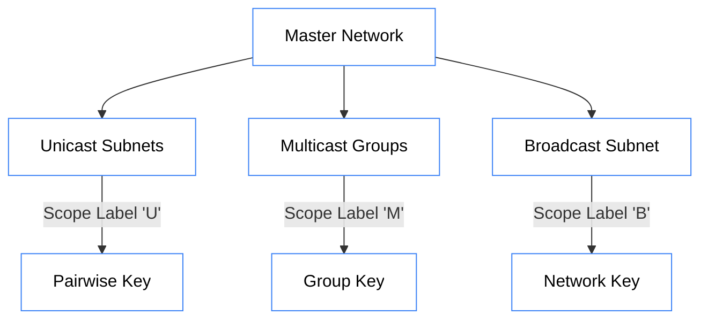

import { Fingerprint, Network, Hash, Info } from 'lucide-react';
import CallsignConverterMDX from '@/components/visualizer/CallsignConverterMDX';

# <Fingerprint className="inline w-6 h-6 mr-2 text-blue-400" /> 1. Addressing & Subnets

Hermes Link uses a flat 48-bit (6-byte) address space. This size was chosen to provide globally unique identification while remaining compact enough for low-bandwidth headers.

## 1.1 Node Addresses (Base40)

To maintain interoperability with existing digital radio standards (like M17), Hermes derives a 6-byte address from a string of up to **9 characters** using **Base40** encoding. These strings are typically amateur radio callsigns but can be unit commands (e.g., `ECHO`, `UNLINK`).

<CallsignConverterMDX />

### 1.1.1 Encoding Alphabet

The M17 alphabet consists of 40 characters:

| Value | Character | ASCII | Note |
| :--- | :--- | :--- | :--- |
| **0** | `Space` | 0x20 | Also any invalid character |
| **1-26** | `A-Z` | 0x41-0x5A | Uppercase |
| **27-36** | `0-9` | 0x30-0x39 | Decimal |
| **37** | `-` | 0x2D | Hyphen / Dash |
| **38** | `/` | 0x2F | Forward Slash |
| **39** | `.` | 0x2E | Period |

### 1.1.2 Encoding Algorithm

A callsign is encoded **backwards**, from the last character to the first. 

1. **Input**: A string of 1-9 characters (e.g., `AB1CD`).
2. **Reverse Process**: The first character of the callsign occupies the least significant bits.
3. **Summation**:
```math
Address = \sum_{i=0}^{N-1} c_i \cdot 40^i
```
where $c_i$ is the value of the character at position $i$ (0-indexed from left).

### 1.1.3 C-Style Pseudocode (Ref: M17 Appendix A.4)

```c
void Encode(const char* callsign, uint8_t* pUChar) {
    uint64_t address = 0;
    const char* p = callsign;
    
    // Find last char (max 9)
    while (*p++ && (p - callsign < 9));
    
    // Process backwards: address = 40 * address + val
    for (p--; p >= callsign; p--) {
        unsigned val = 0;
        if ('A' <= *p && *p <= 'Z') val = *p - 'A' + 1;
        else if ('0' <= *p && *p <= '9') val = *p - '0' + 27;
        else if ('-' == *p) val = 37;
        else if ('/' == *p) val = 38;
        else if ('.' == *p) val = 39;
        else if ('a' <= *p && *p <= 'z') val = *p - 'a' + 1;
        address = 40 * address + val;
    }
    
    // Convert to Network Byte Order (Big Endian)
    for (int i=5; i>=0; i--) {
        pUChar[i] = address & 0xFF;
        address /= 0x100;
    }
}
```

## 1.2 Address Space

Because $40^9 < 2^{48}$, there are addresses that cannot be represented by 9-character Base40 strings.

| Address Range | Category | Description |
| :--- | :--- | :--- |
| `0x00...00` | **Reserved** | Reserved for future use. |
| `0x00...01` - `0xEE6B27FFFFFF` | **Standard** | Encodable "A" to ".........". |
| `0xEE6B28000000` - `0xFFFFFFFFFFFE` | **Extended** | For internal application use. |
| `0xFFFFFFFFFFFF` | **Broadcast** | Delivered to every node (Destination only). |

## 1.3 Subnet Hierarchy

Hermes logical subnets are defined by their encryption context rather than their physical frequency.



> [!NOTE]
> Even if two nodes are on the same physical frequency, they are cryptographically isolated into different subnets unless they share the same **Master Network Key** and **Scope Secret**.
