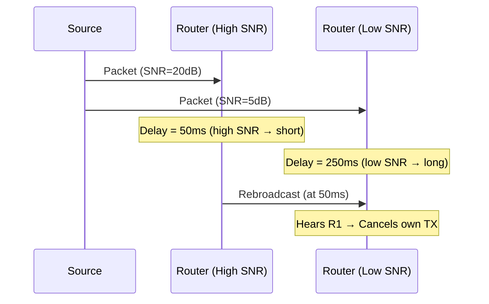
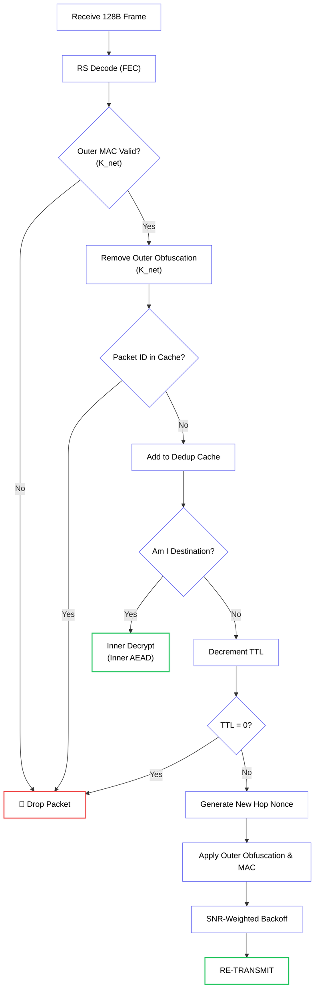

import { Share2, Repeat, Zap, Gauge, Radio, Signal } from 'lucide-react';
import MeshVisualizerMDX from '@/components/visualizer/MeshVisualizerMDX';

# <Share2 className="inline w-6 h-6 mr-2 text-emerald-400" /> 2. Controlled Flooding

Hermes utilizes a **Controlled Flooding** algorithm to propagate messages across the mesh. This approach eliminates the need for complex routing tables or master "coordinator" nodes — every node autonomously makes forwarding decisions based on the physical signal quality of the packet it received.

---

## 2.1 The Flooding Algorithm

When a node receives a packet that is not addressed to itself, it acts as a **Router**. To prevent the "Broadcast Storm" problem (where $N$ nodes each blindly retransmit, creating $N^2$ redundant transmissions), routers use three mechanisms:

1. **Deduplication Cache**: Every node tracks the last 256 unique **Packet IDs** it has seen. If a Packet ID is already in the cache, the packet is silently discarded.
2. **SNR-Weighted Backoff**: Before rebroadcasting, a node calculates a wait time that is **inversely proportional** to the SNR of the packet it received. Higher-SNR nodes wait less.
3. **Rebroadcast Suppression**: If a node hears the same packet being rebroadcasted by *another* node while still waiting, it **cancels** its own retransmission.

### Why This Works

Nodes with higher SNR are geographically closer to the transmitter or have a better propagation path. By letting them "win" the race to rebroadcast, the packet jumps further across the mesh in fewer hops. Nodes with marginal links never waste airtime — they only retransmit if no better node steps up.



---

## 2.2 The Backoff Calculation

The SNR-weighted backoff uses the LQ-CSMA framework described in [**§4.6 LQI-Driven Flood Backoff**](../transport/04-lqi). The simplified version:

```c
/**
 * @brief Calculates forwarding delay based on received SNR.
 * Higher SNR → shorter delay → node wins the rebroadcast race.
 */
uint32_t Hermes_CalculateBackoff(int8_t snr, uint8_t ttl) {
    // Base delay floor (minimum CCA + turnaround)
    uint32_t base = 30;

    // Graded SNR penalty: weaker signals wait longer
    // At SNR=20dB → penalty=0; at SNR=0 → penalty=200ms
    uint32_t snr_penalty = 0;
    if (snr < 20) {
        snr_penalty = (uint32_t)((20 - snr) * 10);
    }

    // TTL bonus: packets near death get slight priority
    uint32_t ttl_bonus = (ttl < 3) ? 20 : 0;
    
    // Random jitter to break ties between equidistant nodes
    uint32_t jitter = rand() % 30;
    
    return base + snr_penalty - ttl_bonus + jitter;
}
```

---

## 2.3 Hop-by-Hop Processing

At every hop, a router performs the following operations in sequence:



**Key property:** The **Inner Layer** is **never touched** by routers. They only remove the outer obfuscation to read routing metadata and then re-apply the **Outer Layer** with a new Hop Nonce. Routers verify the **Outer MAC** to ensure the packet belongs to their mesh, but they lack the keys to decrypt the inner layer.

---

## 2.4 Duplicate Suppression Effectiveness

In a typical mesh of $N$ nodes all within range of each other, standard flooding would produce $N-1$ retransmissions per packet. With SNR-weighted suppression:

- The **1-2 strongest nodes** rebroadcast within the first 50ms.
- The remaining nodes **hear the retransmission** and cancel.
- Effective retransmission count drops to **2-3** regardless of $N$.

This reduces airtime consumption by **60-80%** compared to naive flooding, which is critical on the shared, low-bandwidth FSK1200 channel.

---

## 2.5 Interactive Mesh Simulator

<MeshVisualizerMDX />

> [!TIP]
> **Energy Efficiency:** Controlled flooding is inherently energy efficient because most retransmissions are suppressed, allowing the radio to return to sleep mode early. Only nodes at the geographic edge of the flood wavefront actively transmit.
