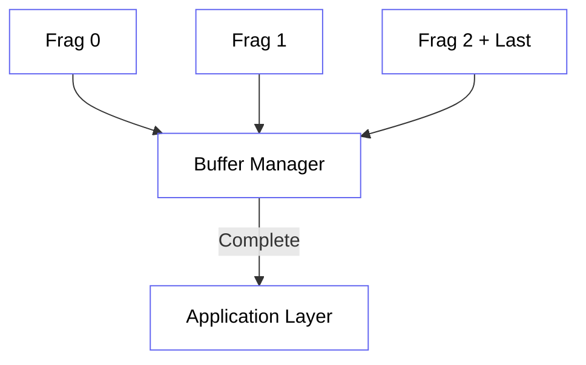

import { Layers, FileStack, ShieldAlert } from 'lucide-react';

# <FileStack className="inline w-6 h-6 mr-2 text-orange-400" /> 3. Fragmentation

Because the Hermes physical frame is limited to a **56-byte payload**, many application-layer messages (like long texts or telemetry batches) must be split into multiple fragments.

## 3.1 Header Controls

Fragmentation is managed by four bits in the Transport Layer Header (Byte 1):

- **Fragment Index (4 bits)**: The current position (0-15).
- **Last Fragment (1 bit)**: Flag indicating the end of the chain.

## 3.2 Max Payload Size

With 16 fragments and 56 bytes per packet, the maximum reassembled payload for a single logical "Message" is:
```math
16 \times 56 = 896 \text{ Bytes}
```

## 3.3 Reassembly Workflow

1. **Buffer Allocation**: The receiver allocates space based on the incoming `Packet ID`.
2. **Missing Detection**: The receiver tracks which indices have arrived. 
3. **Reassembly**: Once the `Last Fragment` has been received and all intermediate indices are present, the payload is handed to the application layer.



## 3.4 Out-of-Order Handling

Nodes must be able to handle fragments arriving out-of-order due to multi-path mesh propagation. The `Fragment Index` provides the absolute offset, allowing the receiver to slot data into the correct memory location regardless of arrival sequence.

> [!WARNING]
> If any fragment in the chain is lost and cannot be recovered via mesh re-transmissions, the entire reassembly fails and the buffer is discarded after a 30-second timeout.
