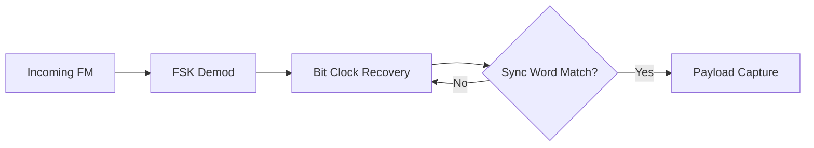

import { Activity, Clock, Zap } from 'lucide-react';

# <Activity className="inline w-6 h-6 mr-2 text-indigo-400" /> 2. Pulse Shaping & Timing

To ensure reliable data extraction at the 1.2 kbps rate, the Hermes protocol relies on precise hardware-assisted clock recovery and specific pulse shaping rules.

## 2.1 Symbol Timing

Every bit (1 or 0) in the Hermes stream is allocated exactly **833.3 microseconds** ($1/1200$ seconds). 

Stability of the local oscillator (TCXO) is critical. A drift of more than 50 PPM over a 128-byte packet duration can result in bit-slip errors, though the Reed-Solomon layer is capable of recovering from such events if identified early.

## 2.2 Clock Recovery (Bit-Sync)

The receiver initiates bit-sync during the **Preamble phase**. The hardware PLL (Phase Locked Loop) tracks the alternating bits (`10101010`) to align the internal sampling clock with the center of the received FSK eyes.

## 2.3 Hardware Filtering

To minimize Interference from adjacent channels, the BK4819 implementation uses internal digital Low-Pass Filters (LPF).

| Filter Stage | Settings | Purpose |
| :--- | :--- | :--- |
| **IF Filter** | 12.5 kHz | Rejects adjacent channel noise |
| **Decimation** | x8 | Increases Effective Number of Bits (ENOB) |
| **Smoothing** | Enabled | Reduces high-frequency spikes in RSSI |

> [!TIP]
> **Oversampling Recommendation**
> While the hardware handles the 1.2kbps clock, software implementations should ideally sample the FSK discriminator output at **9600 Hz** (8x oversampling) to provide enough resolution for high-performance software-defined radio (SDR) decoders.
