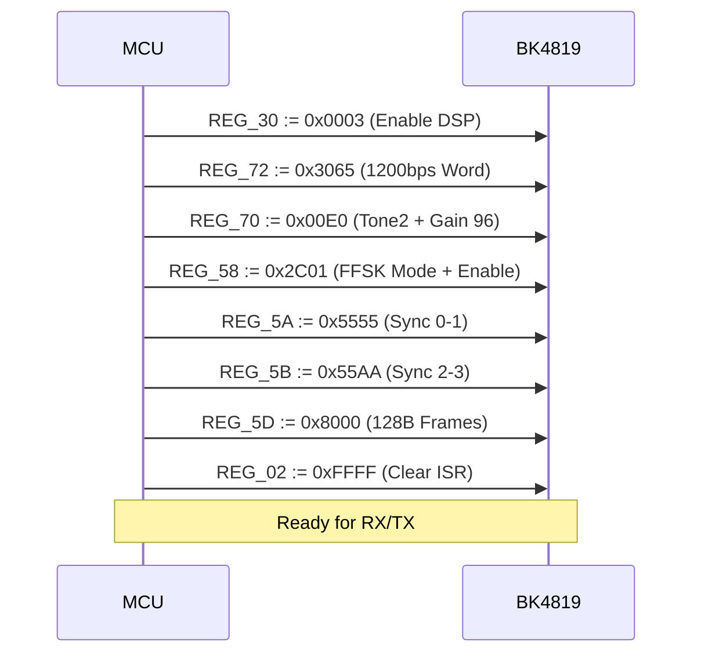

import { Cpu, Terminal, Zap, Activity } from 'lucide-react';

# <Cpu className="inline w-6 h-6 mr-2 text-blue-400" /> BK4819 Hardware Register Map

This document provides a bit-level exhaustive reference for implementing the Hermes Link physical layer on the Beken **BK4819** transceiver. All values are hexadecimal unless otherwise specified.

## 0. Hardware Initialization Flow

The following sequence MUST be followed to reliably enter FSK1200 mode from a cold boot.

## 1. Power & Initialization

Before configuring the FFSK modem, the internal DSP and PLL must be enabled.

### REG_30: System Control
| Bit | Name | Hermes Value | Description |
| :--- | :--- | :--- | :--- |
| 15 | VCO_CALIB | `0` | VCO Calibration (set to 1 temporarily to calibrate) |
| 1 | TX_DSP_EN | `1` | Enable TX Digital Signal Processing |
| 0 | RX_DSP_EN | `1` | Enable RX Digital Signal Processing |

## 2. Modem Configuration

Hermes utilizes **FFSK 1200/1800** (Fast Frequency Shift Keying) for maximum receiver compatibility.

### REG_58: Modem Settings
| Bit | Name | Value | Description |
| :--- | :--- | :--- | :--- |
| 15:13 | TX_MODE | `1` | **FFSK 1200/1800 TX**. Direct FM, no tones. |
| 12:10 | RX_MODE | `7` | **FFSK 1200/1800 RX**. Specialized discriminator loop. |
| 9:8   | RX_GAIN | `3` | Maximum FSK RX sensitivity gain. |
| 5:4   | PREAMBLE | `0` | Preamble type: `0xAA` or `0x55`. |
| 3:1   | BW_SET | `1` | Bandwidth: **FFSK 1200/1800**. |
| 0     | FSK_EN | `1` | Enable FSK Modem. |

### REG_72: Frequency Word (Baudrate)
For 1200bps FFSK using a 26MHz XTAL:
- **Value**: `0x3065`
- **Formula**: $Freq_{Hz} \times 10.32444$

### REG_70: Tone & Gain
| Bit | Name | Value | Description |
| :--- | :--- | :--- | :--- |
| 15 | TONE1_EN | `0` | Disable Tone 1 (used for AFSK). |
| 7  | TONE2_EN | `1` | **Enable Tone 2** (Required for FSK baudrate timing). |
| 6:0 | TONE2_GAIN| `96`| Tuning gain for the FFSK loop. |

## 3. FIFO & Framing

The BK4819 manages packet reassembly via a hardware FIFO accessed through `REG_5F`.

### REG_59: FIFO Control
| Bit | Name | Hermes Value | Description |
| :--- | :--- | :--- | :--- |
| 15 | CLR_TX | `1 / 0` | Pulse to 1 to clear TX FIFO. |
| 14 | CLR_RX | `1 / 0` | Pulse to 1 to clear RX FIFO. |
| 13 | SCRAMBLE | `0` | **Disabled**. (Hermes uses software PN15 whitening). |
| 12 | RX_EN | `1` | Enable FSK Receiver. |
| 11 | TX_EN | `1` | Enable FSK Transmitter. |
| 7:4 | PRE_LEN | `15` | Preamble length (1111b = 16 bytes). |
| 3   | SYNC_LEN | `1` | Sync length (1 = 4 bytes). |

### REG_5A & REG_5B: Sync Words
Hermes uses a standard FSK sync sequence:
- **REG_5A**: `0x5555` (Sync Bytes 0 & 1)
- **REG_5B**: `0x55AA` (Sync Bytes 2 & 3)

### REG_5D: Packet Size
Defines the total size of the data block in bytes.
- **Value**: `(128 << 8)` or `0x8000` (for standard 128-byte Hermes frames).

## 4. Interrupts & Monitoring

Real-time processing is handled via `REG_02`.

### REG_02: Interrupt Status & Mask
| Bit | Identifier | Description |
| :--- | :--- | :--- |
| 15 | **TX_FINISHED** | Triggered when the TX FIFO is empty and transmission stopped. |
| 13 | **RX_FINISHED** | Whole packet (per REG_5D size) has been captured. |
| 12 | **FIFO_ALMOST_FULL**| FIFO reached threshold (set in `REG_5E`). |
| 1  | **RX_SYNC** | Sync Word detected. Carrier lock established. |

### REG_5E: Threshold Settings
- **Bits 6:0**: Almost Full Threshold (Hermes recommended: `2`)
- **Bits 2:0**: Almost Empty Threshold (Hermes recommended: `1`)

---

> [!TIP]
> **Implementation Note**
> Always write to `REG_02` with value `0` before starting a new RX cycle to clear any pending interrupt latch from the previous transmission.
