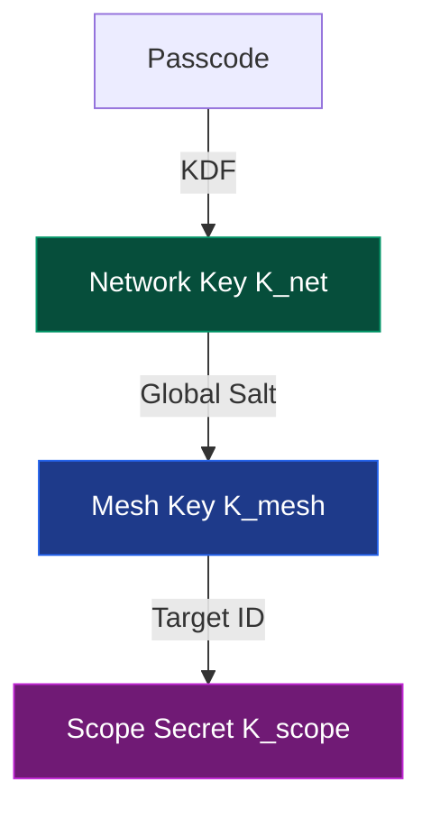

import { FileKey2, Key, Info } from 'lucide-react';
import KdfVisualizerMDX from '@/components/visualizer/KdfVisualizerMDX';

# <FileKey2 className="inline w-5 h-5 mr-2 text-indigo-400" /> 2. Key Management (KDF)

Hermes uses a one-way Key Derivation Function (KDF) to turn human-readable passcodes into cryptographically strong 256-bit keys.

## 2.1 The Key Hierarchy

To maintain both mesh-wide connectivity and private end-to-end communication, keys are derived in a "Waterfall" fashion.



## 2.2 Interactive Key Derivation

Use the tool below to see how your network key is derived from your passcode and salt.

<KdfVisualizerMDX />

## 2.3 KDF Algorithm Specification

The KDF stretches a user-provided passcode into a high-entropy 256-bit key while preventing rainbow-table attacks.

### 2.1.1 Inputs

- **`Passcode`**: Human-readable ASCII string (e.g., "secret-mesh-zone").
- **`Network Salt`**: A 128-bit (16-byte) value shared by all members of the mesh.

### 2.1.2 Workflow

1. ```math
   M = Salt \parallel Passcode
   ```
2. Pad `M` to 64 bytes using `10*1` bit-padding.
3. Initialize 512-bit ChaCha20 state with $M$.
4. Generate Initial Work Factor:
   ```math
   W = \text{ChaCha20\_Round\_Function}(State)
   ```
5. Iterate $N$ times for hardening:
   - ```math
     W = ChaCha20_PRF(Key = W, Nonce = Salt[0:11])
     ```
6. **Result**: The final 256-bit $K_{mesh}$ is the current value of $W$.

## 2.2 KDF Implementation (C)

```c
/**
 * @brief Derives the 256-bit Network Key (K_mesh).
 */
void Hermes_DeriveNetworkKey(const char* passcode, const uint8_t* salt, uint8_t* out_key) {
    uint8_t current_w[32];
    uint32_t iterations = 10000;
    
    // Initial absorption phase (Simplified)
    Hermes_Sponge_Absorb(salt, 16, passcode, strlen(passcode), current_w);
    
    // Hardening loop
    for (uint32_t i = 0; i < iterations; i++) {
        // ChaCha20 PRF: use current_w as key, salt[0:11] as nonce
        ChaCha20_PRF(current_w, salt, current_w); 
    }
    
    memcpy(out_key, current_w, 32);
}
```

## 2.3 Key Storage Best Practices

1. **At Rest**: $K_{mesh}$ should be stored in the device's internal **Secure EEPROM** or **Encrypted NVS partition**.
2. **In Use**: The key should be loaded into RAM only once at boot and cleared if the device enters a "Locked" or "Tamper Detected" state.

> [!WARNING]
> If the **Network Salt** is changed, all nodes must be re-paired with the new salt, as they will be unable to communicate using the old $K_{mesh}$.
