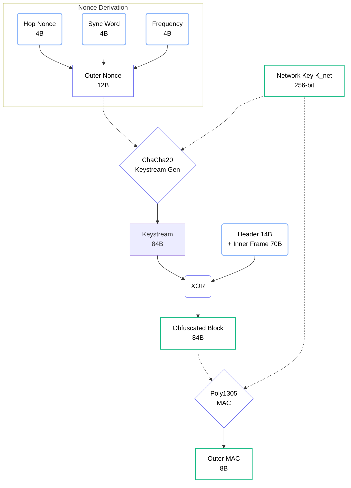

import NestedTrustVisualizerMDX from '@/components/visualizer/NestedTrustVisualizerMDX';
import { ShieldAlert, ShieldCheck, EyeOff } from 'lucide-react';

# <EyeOff className="inline w-6 h-6 mr-2 text-indigo-400" /> 3. Inner & Outer Encryption

Hermes Link achieves "Total Unlinkability" by using a dual-layered technical approach. This ensures that even routing nodes cannot see who sent a message, nor even determine if multiple packets belong to the same session.

## 3.1 Stacked Security Model

The conceptual model for Hermes security is the **Nested Layer** stack.

<NestedTrustVisualizerMDX />

### 3.1.1 Layers of Defense

1. **Inner Layer (End-to-End)**:
   - **Key**: Traffic Key ($K_{scope}$)
   - **Scope**: Payload + Sender Address.
   - **Purpose**: Privacy between the originator and the recipient.
2. **Outer Layer (Hop-by-Hop)**:
   - **Key**: Network Key ($K_{net}$)
   - **Scope**: Entire Header (except Hop Nonce) + Inner Frame (Payload + Inner MAC).
   - **Purpose**: Obfuscation to hide packet signatures, routing metadata, and data bits from passive observers.

## 3.2 Outer Obfuscation

The Outer Layer acts as **Outer Obfuscation.** Because the **Hop Nonce** in the header changes at every hop, the bits of the packet body and header change completely at every hop, preventing tracking and pattern analysis.

### 3.2.1 Obfuscation Scope
To maintain "Total Unlinkability," the keystream XORs almost the entire packet:
- **Header (20 Bytes)**: Bytes 0-19 are masked.
- **Hop Nonce (4 Bytes)**: Bytes 20-23 remain in **Cleartext** to bootstrap de-obfuscation.
- **Inner Frame (64 Bytes)**: Bytes 24-87 (Payload + **Inner MAC**) are masked.

### 3.2.2 Nonce Derivation (12 Bytes)
Anyone with $K_{net}$ can reconstruct the keystream by deriving the nonce from clear physical markers:

| Byte Range | Component | Source |
| :--- | :--- | :--- |
| `[0:3]` | **Hop Nonce** | Header (Clear) |
| `[4:7]` | **Sync Word** | Physical Framing |
| `[8:11]` | **Frequency** | RX Context (Hertz) |

```c
// Deriving the 12-byte Nonce for ChaCha20
uint8_t nonce[12];
memcpy(nonce, packet->hop_nonce, 4);
memcpy(nonce + 4, network_sync_word, 4);
*(uint32_t*)(nonce + 8) = rx_frequency_hz;
```

To prevent attackers from swapping a valid header onto a different payload, a final **Outer MAC** is visible at the tail of the packet (Bytes 88-95). This "anchors" the obfuscated block to the specific Hop Nonce.



## 3.4 Summary: Layers of Verification
1. **Inner MAC**: Verifies E2E integrity and Source authenticity. Resides **inside** the outer obfuscation layer.
2. **Outer MAC**: Verifies hop-by-hop integrity. Resides **outside** the obfuscated block.

> [!IMPORTANT]
> **Performance Consideration**
> The **Inner Layer** is designed to avoid expensive "Trial Decryption" for the recipient. Hermes solves this by excluding the **Source** from the input of $K_{scope}$ derivation, but including the **Destination** and a context label (Section 5.1). The receiver knows the **Destination** and can immediately derive the correct key in a single pass.
