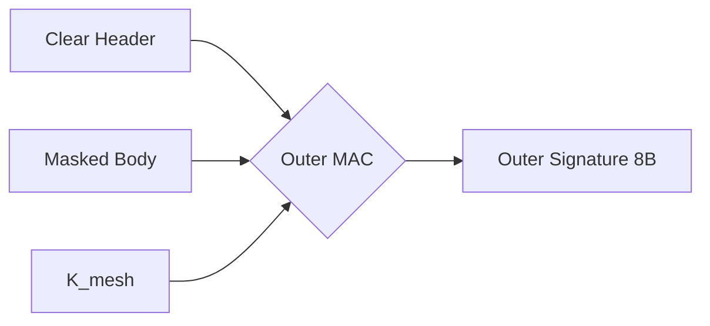

import NestedTrustVisualizerMDX from '@/components/visualizer/NestedTrustVisualizerMDX';
import { ShieldAlert, ShieldCheck, EyeOff } from 'lucide-react';

# <EyeOff className="inline w-6 h-6 mr-2 text-indigo-400" /> 3. Sealed Sender & Obfuscation

Hermes Link achieves "Total Unlinkability" by using a dual-layered encryption approach. This ensures that even routing nodes cannot see who sent a message.

## 3.1 Nested Trust Model

The conceptual model for Hermes security is the **Nested Trust** stack.

<NestedTrustVisualizerMDX />

### 3.1.1 Layers of Defense

1. **Inner Layer (End-to-End)**:
   - **Key**: Traffic Key ($K_{scope}$)
   - **Scope**: Payload + Sender Address.
   - **Purpose**: Privacy between the originator and the recipient.
2. **Outer Layer (Hop-by-Hop)**:
   - **Key**: Network Key ($K_{mesh}$)
   - **Scope**: Entire 64-byte ciphertext block (Inner Ciphertext + Inner MAC).
   - **Purpose**: Obfuscation to hide packet signatures and data bits from passive observers.

## 3.2 Chameleon Skin (Obfuscation)

The Outer Layer acts as a **"Chameleon Skin."** Because the **Hop Nonce** in the header changes at every hop, the bits of the packet body change completely at every hop, even if the payload remains static.

### 3.2.1 The Invisible Binding (Outer MAC)

To prevent attackers from swapping a valid header onto a different payload, the **Outer MAC** (Poly1305) is calculated over:
- `[Header]` (including TTL and Hop Nonce)
- `[Masked Payload]` (Post-obfuscation)
- `[Masked Inner MAC]` (Post-obfuscation)

## 3.3 Sealed Sender Privacy

By encrypting the **Source (Sender) Address** inside the Inner Layer:
1. Intermediate routers can only see the **Destination**. 
2. They cannot determine which node generated the packet.
3. Traffic analysis is defeated as all packets traveling between the same two nodes look like random fluctuations.

> [!IMPORTANT]
> **Performance Consideration**
> Sealed Sender usually requires "Trial Decryption" by the recipient (trying every key until one works). Hermes solves this by excluding the **Source** from the input of $K_{scope}$ derivation (Section 6.5.1). The receiver knows the **Destination** and can immediately look up the associated secret to derive the correct key in a single pass.
