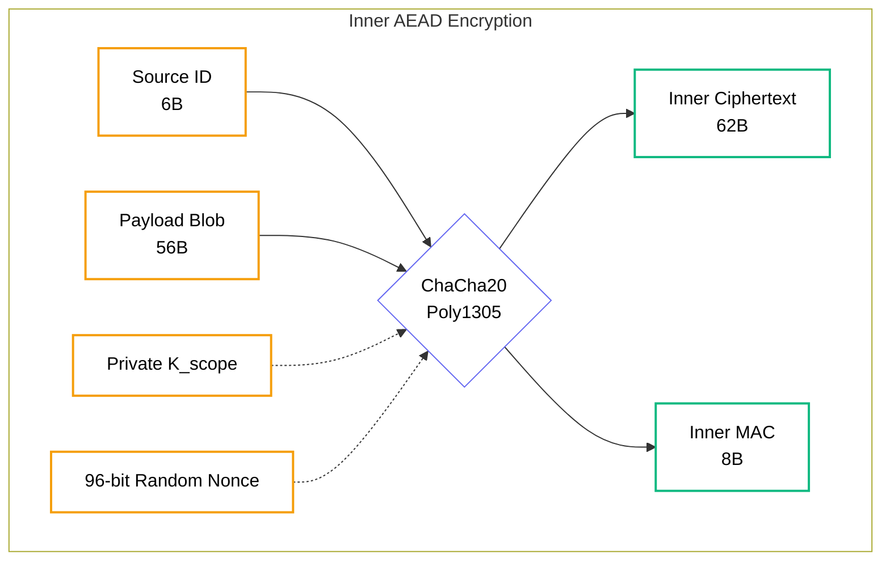
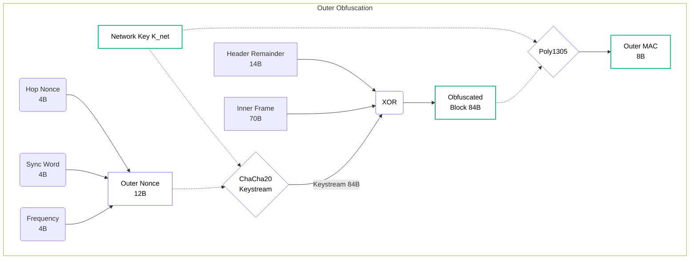

import { Zap, Shield, Eye, Lock } from 'lucide-react';
import NestedTrustVisualizerMDX from '@/components/visualizer/NestedTrustVisualizerMDX';

# <Zap className="inline w-6 h-6 mr-2 text-yellow-400" /> 4. Encryption Pipeline

To understand Hermes security, we must trace a 56-byte message through its transformation from plaintext to radio waves.

## 4.1 Step 1: End-to-End AEAD (Inner Layer)
**Goal**: Establish the **Inner Encryption** for privacy between sender and recipient.

1. The sender constructs a **96-bit Inner Nonce** from `PacketID (6B) || Destination (6B)`.
2. The sender derives $K_{scope}$ using $K_{net}$, the **Scope Label**, the **Destination ID**, and the **Scope Secret** (Section 5.1).
3. The **56-byte Payload** and the **6-byte Source ID** are encrypted using **ChaCha20-Poly1305**.
4. **Result**: A 62-byte cipher block containing the encrypted inner data and an 8-byte **Inner MAC**. Total inner block size = `70 bytes`.

## 4.2 Step 2: Outer Layer (Hop-by-Hop)
**Goal**: Hide routing metadata and signatures from passive listeners.

1. The sender (or router) selects a **32-bit Hop Nonce** (Cleartext).
2. A **12-byte Outer Nonce** is built using the **Hop Nonce**, the RF **Sync Word**, and the RX **Frequency**.
3. An **Obfuscation Keystream** is derived from $K_{net}$ and this 12-byte Nonce.
4. An `84-byte` block consisting of the **Header** (excluding Hop Nonce) and the **Inner Frame** (Source ID + Payload + Inner MAC) is XORed with the keystream.
5. An 8-byte **Outer MAC** is calculated over the obfuscated block using Poly1305 and $K_{net}$.
6. **Result**: A 96-byte bitstream containing exactly 84 bytes of obfuscated data block, a 4-byte cleartext Hop Nonce, and an 8-byte cleartext Outer MAC.

> [!NOTE]
> **Why dual MACs?** The Inner MAC proves to the final destination that the *original sender* wrote the payload. The Outer MAC proves to the next-hop router that the packet belongs to this mesh network and wasn't corrupted in the air.

## 4.3 Step 3: LFSR Whitening (Physical Layer)
**Goal**: Spectral integrity and DC bias elimination for the radio hardware.

1. The 96-byte packet is XORed with a **PN15 LFSR sequence** (x^15 + x^14 + 1).
2. **Result**: A whitened 96-byte bitstream ready for Forward Error Correction (FEC) encoding, which expands it into the final 128-byte physical frame for FSK modulation.

---

## 4.4 Intuitive Byte Map

This map visualizes exactly which bytes of a packet are readable (🟢) vs hidden (🔴) at each stage of the transmitting pipeline.

| Byte Range | Content | 1. Before Crypto | 2. After Inner AEAD | 3. After Outer Obfuscation |
| :--- | :--- | :--- | :--- | :--- |
| `0-13` | **Routing / Dest** | 🟢 Cleartext | 🟢 Cleartext | 🔴 Obfuscated ($K_{net}$) |
| `14-19` | **Source ID** | 🟢 Cleartext | 🔴 Encrypted ($K_{scope}$) | 🔴 Obfuscated ($K_{net}$) |
| `20-23` | **Hop Nonce** | 🟢 Cleartext | 🟢 Cleartext | 🟢 **Cleartext** (To Boot) |
| `24-79` | **Payload Blob** | 🟢 Cleartext | 🔴 Encrypted ($K_{scope}$) | 🔴 Obfuscated ($K_{net}$) |
| `80-87` | **Inner MAC** | (Empty) | 🔴 Generated ($K_{scope}$) | 🔴 Obfuscated ($K_{net}$) |
| `88-95` | **Outer MAC**| (Empty) | (Empty) | 🟢 **Cleartext** (Generated via $K_{net}$) |

---

## 4.5 The "Public" Pipeline (Discovery Packets)

Even though **Type 4 Discovery** packets are meant to be read by anyone on the local mesh, they **do not skip the security pipeline**. Skipping the pipeline would break hardware acceleration and introduce parsing vulnerabilities.

Instead, Discovery and Broadcast packets flow through the exact same encryption steps, but with one critical difference:

**The Inner AEAD uses a specialized Context where the Scope Secret is `NULL` (All Zeros).**

Because the Scope Secret is empty, *any* node that possesses the network-wide $K_{net}$ can perfectly derive the necessary $K_{scope}$ to decrypt the inner payload. This allows nodes to securely advertise their Human Identity (Alias, Status) and Health (Battery, LQI) to neighbors without requiring a pre-shared private key.

---

## 4.6 Security Properties

    

        <h4 className="flex items-center text-blue-400 font-bold mb-2">
            <Lock className="w-4 h-4 mr-2" /> Confidentiality
        </h4>
        
Only the holder of the specific Scope Secret can read the actual message payload.

    

    

        <h4 className="flex items-center text-emerald-400 font-bold mb-2">
            <Shield className="w-4 h-4 mr-2" /> Integrity
        </h4>
        
If even a single bit is flipped in transit, the $K_{net}$ Poly1305 MAC will fail, and the packet is dropped immediately.

    

    

        <h4 className="flex items-center text-purple-400 font-bold mb-2">
            <Eye className="w-4 h-4 mr-2" /> Anonymity
        </h4>
        
Because the Source ID and Payload are protected by **Inner Encryption**, observers cannot determine who is talking to whom.

    

    

        <h4 className="flex items-center text-yellow-400 font-bold mb-2">
            <Zap className="w-4 h-4 mr-2" /> Resistance
        </h4>
        
The use of Hop Nonces at every step makes traffic analysis and replay attacks practically impossible.

    

