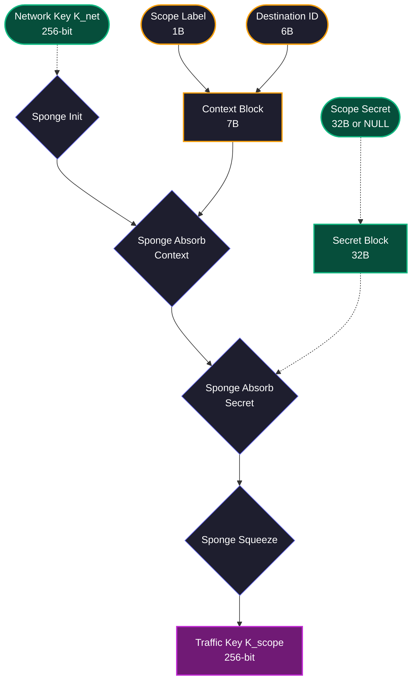

import { Key, Shield, Hash, Info } from 'lucide-react';

# <Key className="inline w-6 h-6 mr-2 text-purple-400" /> 5. Traffic Key Derivation

The **Traffic Key** ($K_{scope}$) is the final 256-bit key used for the **Inner Layer**. This key is derived from the **Network Key** ($K_{net}$), a context-specific **Scope Label**, the **Destination ID**, and a **Scope Secret**.

## 5.1 Derivation Formula

To prevent key leakage between different destinations and ensure proper domain separation, Hermes uses a multi-stage PRF construction.

```math
K_{scope} = \text{PRF}(K_{net}, \text{Label} \parallel \text{Destination} \parallel \text{Secret})
```

The derivation follows a "Sponge" pattern where entropy is absorbed in stages:

1. **Base**: Initialize PRF state with $K_{net}$.
2. **Context**: Absorb the 1-byte **Scope Label** and 6-byte **Destination ID**.
3. **Secret**: Absorb the 32-byte **Scope Secret** (if applicable).
4. **Finalize**: Squeeze the 256-bit $K_{scope}$.



## 5.2 Scope Contexts

The required secret and label vary based on the **Addressing Mode** specified in the packet header.

| Type | Label | Secret Requirement |
| :--- | :--- | :--- |
| **Unicast** | `0x55` ('U') | Pre-shared Contact Secret |
| **Multicast** | `0x4D` ('M') | Pre-shared Group Secret |
| **Broadcast** | `0x42` ('B') | `NULL` (All Zeros) |
| **Discovery** | `0b11` ('D') | `NULL` (All Zeros) |

### 5.2.1 Public & Discovery Contexts

For **Broadcast** and **Discovery** packets, the `scope_secret` is a fixed 32-byte sequence of null bytes ($0^{256}$). 

> [!NOTE]
> This allows public traffic to be decrypted by any node possessing $K_{net}$ while maintaining the same hardware-accelerated pipeline as private traffic.

## 5.3 Technical Implementation (C)

```c
/**
 * @brief Derives K_scope using tiered entropy absorption.
 */
void Hermes_DeriveTrafficKey(const uint8_t* net_key, char label, const uint8_t* dest, const uint8_t* secret, uint8_t* out_key) {
    Hermes_Sponge_State state;
    
    // Stage 1: Initialize with K_net
    Hermes_Sponge_Init(&state, net_key);
    
    // Stage 2: Absorb Context (Label + Destination)
    Hermes_Sponge_Absorb_Byte(&state, (uint8_t)label);
    Hermes_Sponge_Absorb(&state, dest, 6);
    
    // Stage 3: Absorb Secret (or NULL padding)
    static const uint8_t NULL_SECRET[32] = {0};
    Hermes_Sponge_Absorb(&state, secret ? secret : NULL_SECRET, 32);
    
    // Stage 4: Squeeze final Traffic Key
    Hermes_Sponge_Squeeze(&state, out_key, 32);
}
```

> [!IMPORTANT]
> The **Source ID** is explicitly excluded from the inner layer key derivation. This ensures that the recipient can derive $K_{scope}$ using only their own identity (Destination) and the shared secret, without needing to pre-identify the sender.
