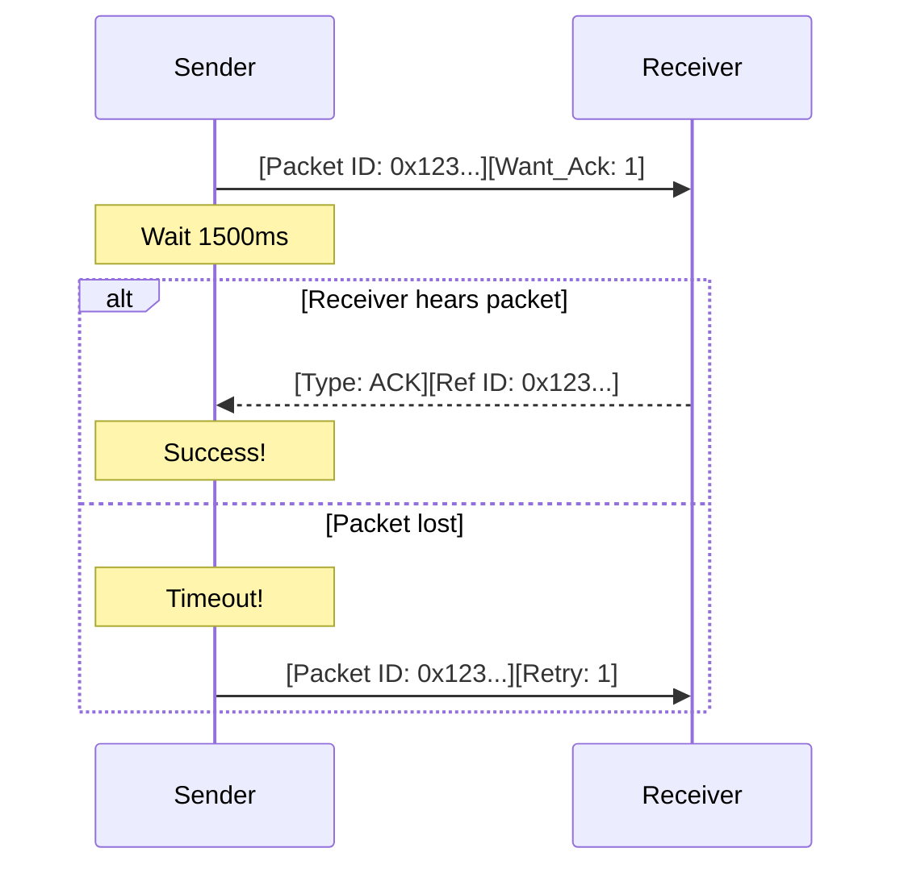

import { CheckCircle2, RotateCcw, Timer } from 'lucide-react';

# <CheckCircle2 className="inline w-6 h-6 mr-2 text-indigo-400" /> 2. Reliability & ACKs

Hermes Link ensures delivery of critical data using an Acknowledgement (ACK) system. This is active for all **Unicast** traffic where the `Want Ack` bit is set in the header.

## 2.1 Stop-and-Wait ARQ

The protocol follows a strictly synchronized **Stop-and-Wait Automatic Repeat Request (ARQ)** model.

1. **Sender**: Transmits packet and waits for `ACK_TIMEOUT`.
2. **Receiver**: Validates packet, computes $K_{scope}$, and returns an ACK packet (Type `0x1`).
3. **Sender**: If ACK is received, transmission is success. If timeout, retry up to `MAX_RETRIES`.

## 2.2 Sequence Diagram

## 2.3 Timing Parameters

| Parameter | Value | Description |
| :--- | :--- | :--- |
| **ACK_TIMEOUT** | 1500 ms | Base wait time for first ACK. |
| **MAX_RETRIES** | 3 | Number of times to re-send before failure. |
| **BACKOFF_STEP**| 500 ms | Incremental delay added to each subsequent retry. |

## 2.4 Duplicate Detection

If a receiver successfully processed a packet and sent an ACK, but the ACK was lost on the return path, the sender will retry.

The receiver MUST use the **Packet ID** to identify the retry as a duplicate. It should **silently discard** the redundant payload but **re-send the ACK** to allow the sender to clear its state.

> [!TIP]
> **Why 1500ms?**
> On a 1.2kbps link, a 128-byte packet takes ~850ms to transmit. Adding mesh relay overhead (hops), a 1.5s timeout is the minimum practical window for a 1-2 hop response.
