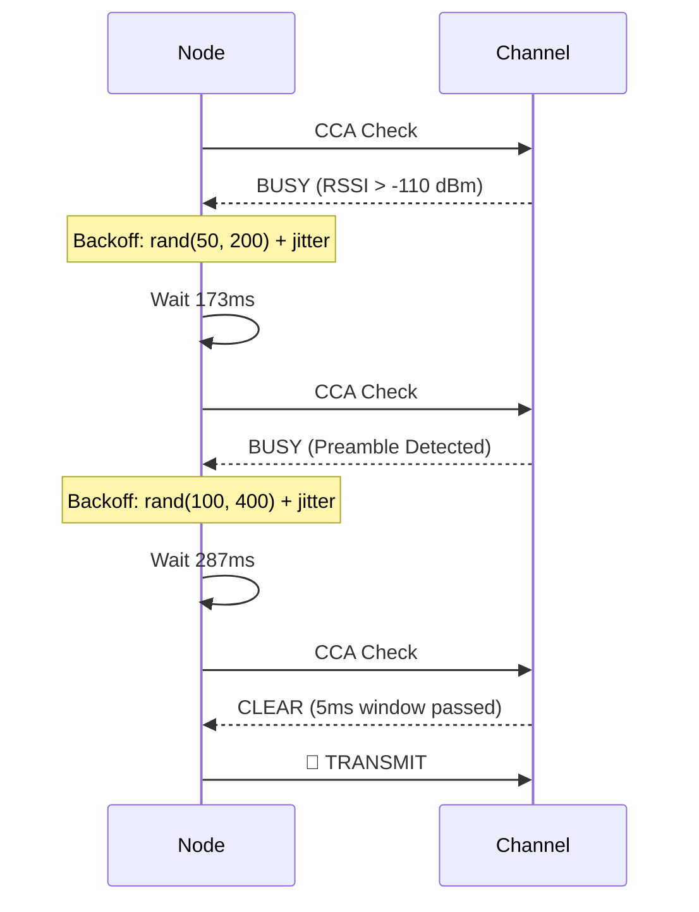
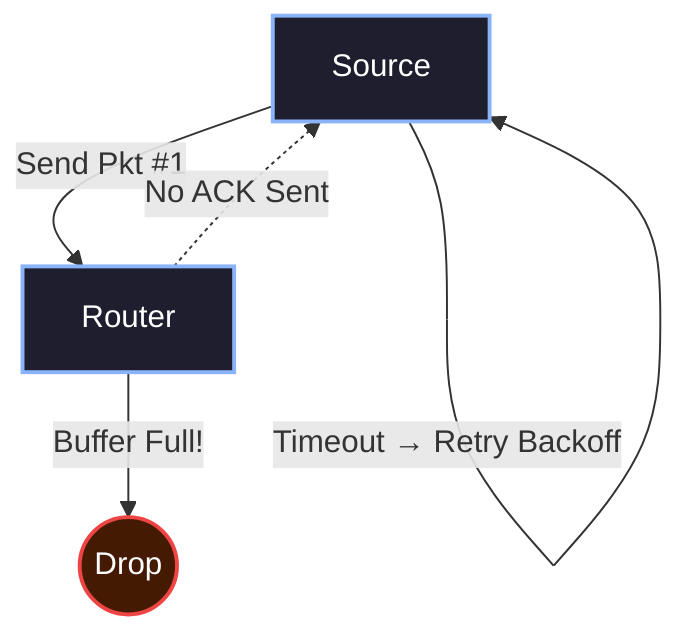

import { Waves, Timer, ShieldAlert, Activity, Radio, Zap } from 'lucide-react';

# <Waves className="inline w-6 h-6 mr-2 text-rose-400" /> 3. Flow Control & CSMA/CA

In a low-bandwidth mesh where nodes share a single RF channel, uncoordinated transmissions cause **collisions** — both packets are destroyed. Hermes Link implements **CSMA/CA** (Carrier Sense Multiple Access with Collision Avoidance) to minimize this.

> [!IMPORTANT]
> All times referenced below assume long-range FSK1200 operation. Faster modulations (e.g. FSK2400) should scale timeouts proportionally.

---

## 3.1 Carrier Sense Mechanism

Before any transmission, a node **MUST** perform a carrier sense check on the BK4819/BK4829 hardware.

### 3.1.1 Clear Channel Assessment (CCA)

The CCA evaluates two independent signals from the radio:

| Signal | Register | Condition for "Clear" |
|:---|:---|:---|
| **RSSI** | `BK4819_REG_67` | Below the **CCA Threshold** (default: -110 dBm). |
| **Preamble Detect** | `BK4819_REG_0C[2]` | No active preamble detected. |

Both conditions must be true simultaneously for a minimum **CCA Window** of **5 ms** to declare the channel clear. If either condition fails at any point during the window, the assessment restarts.

```c
// Hermes CCA Implementation
bool Hermes_IsChannelClear(void) {
    const int16_t rssi = BK4819_GetRSSI();
    const bool preamble = BK4819_GetPreambleDetect();
    
    if (rssi < CCA_THRESHOLD_DBM && !preamble) {
        return true;  // Channel is idle
    }
    return false;  // Channel is busy
}
```

### 3.1.2 CCA Window Sampling

A single instantaneous check is insufficient — a node could sample during a brief inter-symbol gap. The CCA window requires **5 consecutive clear samples** at 1ms intervals:

```c
bool Hermes_WaitForClearChannel(uint32_t max_wait_ms) {
    uint8_t clear_count = 0;
    uint32_t elapsed = 0;
    
    while (elapsed < max_wait_ms) {
        if (Hermes_IsChannelClear()) {
            clear_count++;
            if (clear_count >= 5) return true;  // 5ms clear window
        } else {
            clear_count = 0;  // Reset on any busy sample
        }
        delay_ms(1);
        elapsed++;
    }
    return false;  // Timed out waiting for clear channel
}
```

---

## 3.2 Exponential Backoff with Jitter

When a node finds the channel **busy**, it enters an exponential backoff loop. This is the core collision avoidance mechanism.

### 3.2.1 Contention Window (CW)

The contention window defines the range from which the random backoff delay is selected. It grows exponentially with each failed attempt:

| Attempt | CW_min (ms) | CW_max (ms) | Formula |
|:---:|:---:|:---:|:---|
| **0** (Initial) | 50 | 200 | `CW_base` |
| **1** (1st backoff) | 100 | 400 | `CW_base × 2` |
| **2** | 200 | 800 | `CW_base × 4` |
| **3** | 400 | 1600 | `CW_base × 8` |
| **4** | 800 | 3200 | `CW_base × 16` |
| **5+** | 1000 | 5000 | `CW_max` (clamped) |

### 3.2.2 Jitter

To prevent synchronized retries (where two nodes that collided pick the same backoff), the delay includes **uniform random jitter**:

$$
T_{backoff} = \text{rand}(CW_{min}, CW_{max}) + \text{rand}(0, J_{max})
$$

Where $J_{max}$ = 100 ms (the jitter ceiling).

> [!NOTE]
> **Why jitter matters:** Without jitter, two nodes with identical CW parameters will deterministically collide again after the same backoff period. The random jitter breaks this symmetry.

### 3.2.3 Complete CSMA/CA Pseudocode

```c
#define CW_BASE_MIN    50    // ms
#define CW_BASE_MAX    200   // ms
#define CW_CLAMP_MIN   1000  // ms (max backoff floor)
#define CW_CLAMP_MAX   5000  // ms (max backoff ceiling)
#define JITTER_MAX     100   // ms
#define MAX_CCA_ATTEMPTS 6

typedef enum {
    TX_OK = 0,
    TX_CHANNEL_BUSY,
    TX_FAILED_MAX_RETRIES
} Hermes_TxResult;

Hermes_TxResult Hermes_CSMA_Transmit(uint8_t* packet, uint16_t len) {
    for (uint8_t attempt = 0; attempt < MAX_CCA_ATTEMPTS; attempt++) {
        
        // 1. Clear Channel Assessment
        if (Hermes_WaitForClearChannel(50)) {
            // Channel is clear — transmit immediately
            Hermes_PhysicalTx(packet, len);
            return TX_OK;
        }
        
        // 2. Channel is busy — calculate exponential backoff
        uint32_t cw_min = CW_BASE_MIN << attempt;  // Exponential growth
        uint32_t cw_max = CW_BASE_MAX << attempt;
        
        // Clamp to maximum contention window
        if (cw_min > CW_CLAMP_MIN) cw_min = CW_CLAMP_MIN;
        if (cw_max > CW_CLAMP_MAX) cw_max = CW_CLAMP_MAX;
        
        // 3. Random backoff within contention window + jitter
        uint32_t backoff = rand_range(cw_min, cw_max);
        uint32_t jitter  = rand_range(0, JITTER_MAX);
        uint32_t total_delay = backoff + jitter;
        
        // 4. Wait, but keep listening — if channel clears early, jump out
        uint32_t waited = 0;
        while (waited < total_delay) {
            delay_ms(10);
            waited += 10;
            
            // Optional: early-exit CCA during backoff
            if (Hermes_WaitForClearChannel(5)) {
                Hermes_PhysicalTx(packet, len);
                return TX_OK;
            }
        }
    }
    
    return TX_FAILED_MAX_RETRIES;  // All attempts exhausted
}
```

### 3.2.4 Backoff Visualization



---

## 3.3 Priority Classes

Not all packets are equal. ACKs and retransmissions should get faster channel access than routine telemetry beacons.

| Priority | CW Divisor | Effective CW_max | Use Case |
|:---|:---:|:---:|:---|
| **P0 — Critical** | ÷4 | 50 ms | ACK responses, NACK retries. |
| **P1 — Normal** | ÷1 | 200 ms | Unicast messages, Pings. |
| **P2 — Low** | ×2 | 400 ms | Broadcast, Discovery beacons. |
| **P3 — Background** | ×4 | 800 ms | Periodic telemetry, key ratchets. |

ACKs use the smallest contention window because they are time-critical — the sender is blocking on a 1500ms timeout. If the ACK is delayed by too much backoff, the sender will retry unnecessarily, wasting airtime.

---

## 3.4 Hop-by-Hop Back-pressure

Routers have limited memory for packet buffers (typically **4-8 packets**).

If a router's buffer is full, it should **NOT** acknowledge incoming unicast packets that require routing. By failing to ACK, the sender is forced into its own retry backoff, naturally slowing down the network source until the congestion clears.



---

## 3.5 Multi-Fragment Interleaving

When sending a large fragmented message (e.g., 10 fragments), the sender **MUST** insert a **Gap Delay** between fragments.

- **Recommended Gap**: 200 ms.

This gap allows routing nodes to clear their internal "Transmission Ready" flags and provides a window for other high-priority traffic (like ACKs or Pings) to slip onto the channel.

### 3.5.1 Fragment Pacing


> [!WARNING]
> **Starvation Risk:** Failing to implement gap delays during fragmentation will cause "Starvation" in nearby nodes, as the 100% duty cycle of the sender will prevent anyone else from gaining access to the channel for several seconds.

---

## 3.6 Transmission Timing Budget

Understanding the complete timing of a single packet exchange helps calibrate all the constants above.

| Phase | Duration | Notes |
|:---|:---:|:---|
| **CCA Window** | 5 ms | Minimum clear-channel assessment. |
| **Preamble TX** | 40 ms | 48 bits @ 1200 baud. |
| **Sync Word TX** | 27 ms | 32 bits @ 1200 baud. |
| **Payload TX** | 853 ms | 128 bytes (1024 bits) @ 1200 baud. |
| **Turnaround** | ~20 ms | Radio RX→TX switch time (BK4819). |
| **ACK Preamble+Sync** | 67 ms | ACK packet preamble and sync. |
| **ACK Payload TX** | 853 ms | Full 128-byte ACK frame. |
| **Total Round-Trip** | ~1865 ms | One complete exchange (data + ACK). |

This is why `ACK_TIMEOUT` is set to **1500 ms** — it accounts for one-way transmission time plus mesh relay overhead but avoids waiting for a full unnecessary retry cycle.

> [!TIP]
> **Embedded Tip:** On the BK4819, the RX-to-TX turnaround is dominated by the PLL lock time (~8ms) plus the PA ramp-up (~5ms). Implementations should add a 20ms guard time to be safe.
