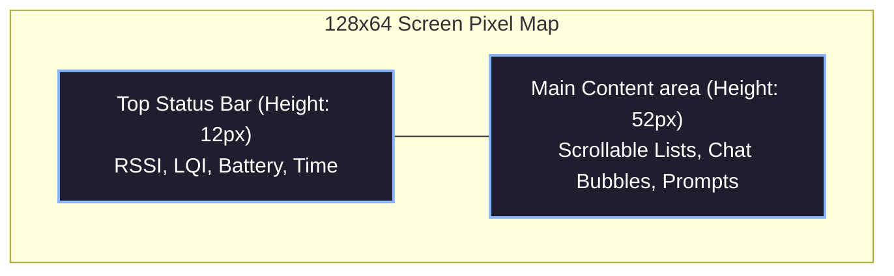

# 1. Screen Layout (128x64)

While the Hermes protocol itself is agnostic to any specific hardware platform, the vast majority of target devices (like the Quansheng UV-K5 series) utilizing the `BK4819` employ a highly constrained **128x64 monochrome pixel matrix** display.

This constraint heavily impacts User Experience (UX) and User Interface (UI) when navigating complex network routing parameters, contacts, and live messaging. The following guidelines define optimal approaches for presenting mesh configurations on such low-resolution displays.

## 1.1 Global Grid System

To maximize readability and ensure a predictable interaction model for users across pages, applications should compartmentalize the `128x64` screen into two primary vertical regions.



### Top Status Bar
- **Dimensions:** `128x12` pixels.
- **Function:** Universally persistent across all menus.
- **Contents:**
  - **Left (Link Quality):** Signal/LQI bars `[|||]`.
  - **Center (Screen Name):** Active context (e.g., `#GLOBAL`, `@Contact`, `Settings`).
  - **Right (Hardware):** Live battery voltage (e.g., `8.2V`).

### Main Content Area
- **Dimensions:** `128x52` pixels.
- **Function:** The interactive view. Optimized for readability on 128x64 pixels.

---

## 1.2 Monospace Interface Mockups

### Home/Main Menu
```text
┌─────────────────────────────────────┐
│[|||]           #GLOBAL         8.4V │
├─────────────────────────────────────┤
│ > 1. MESSAGES (3)                   │
│   2. CONTACTS (12)                  │
│   3. NODE CONFIG                    │
│   4. POWER SETTINGS                 │
│   5. ABOUT HERMES                   │
└─────────────────────────────────────┘
```

### Active Chat View
```text
┌─────────────────────────────────────┐
│[|||]            @W7A           8.2V │
├─────────────────────────────────────┤
│ [W7A]: On my way back.              │
│ [ME] : Copy that.                   │
│                                     │
│ > Typing...                         │
└─────────────────────────────────────┘
```

By standardizing these physical pixels, users will develop muscle memory across the mesh client without getting lost across fragmented page designs.
