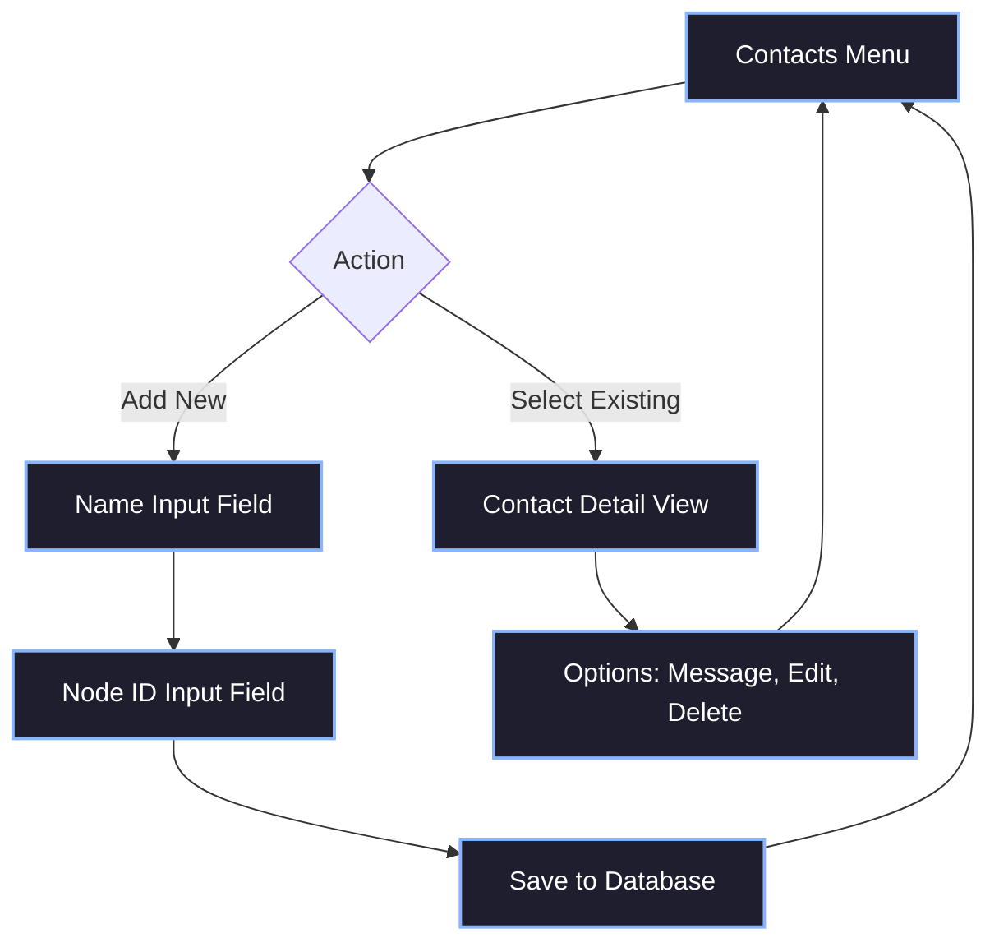

# 2. Managing Contacts

While Hermes natively explicitly routes using **6-Byte Addresses** (typically derived from Call Signs), a 128x64 interface strongly benefits from user-defined aliased names. Instead of raw memory indexes or messy MAC-like hexadecimal, the User Interface abstracts these strings into readable "Contacts".

A typical Contact database implementation persists these details locally mapping a human-readable **Name** structurally to the physical routing **Node ID**.

## 2.1 Contact Properties

When designing a Contact Entry screen on a constrained monochrome display, you must compress the attributes presented to the user.

A standard Contact record includes the following database schema concepts:

- **Alias / Name:** `(e.g., "John Doe", "My Relay", "Alpha Team")`
- **Node ID (Address):** `(6-byte hex identity)`
- **LQI (Link Quality Indicator):** Validated rating (A-F) based on estimated link success probability.


- **RSSI (dBm):** The raw signal strength of the last received frame.

## 2.2 UI Workflow for Editing Contacts

When creating or modifying a contact through the UI keypad:



### Keypad Input Considerations
Due to most devices possessing a numeric keypad formatted via multi-tap (`T9` entry mappings), the string length for contacts should functionally be restricted to roughly `12-16 characters`. 

### Monospace Contact List
```text
┌─────────────────────────────────────┐
│[|||]           CONTACTS        8.2V │
├─────────────────────────────────────┤
│ > [+ NEW CONTACT]                   │
│   @Bob_Base       -85dBm [LQI:A]    │
│   @Relay_01       -105dBm[LQI:C]    │
│   @Unknown        -112dBm[LQI:F]    │
│                                     │
└─────────────────────────────────────┘
```

## 2.3 The "@" Prepend Convention

To structurally distinguish Unicast contacts visually from Multicast aliases inside the chat log rendering strings, the UI should forcibly prepend contact aliases with the `@` symbol (e.g., `@JohnDoe`). This convention matches modern networking habits across IP platforms resulting in swift muscle memory application during deployment.
